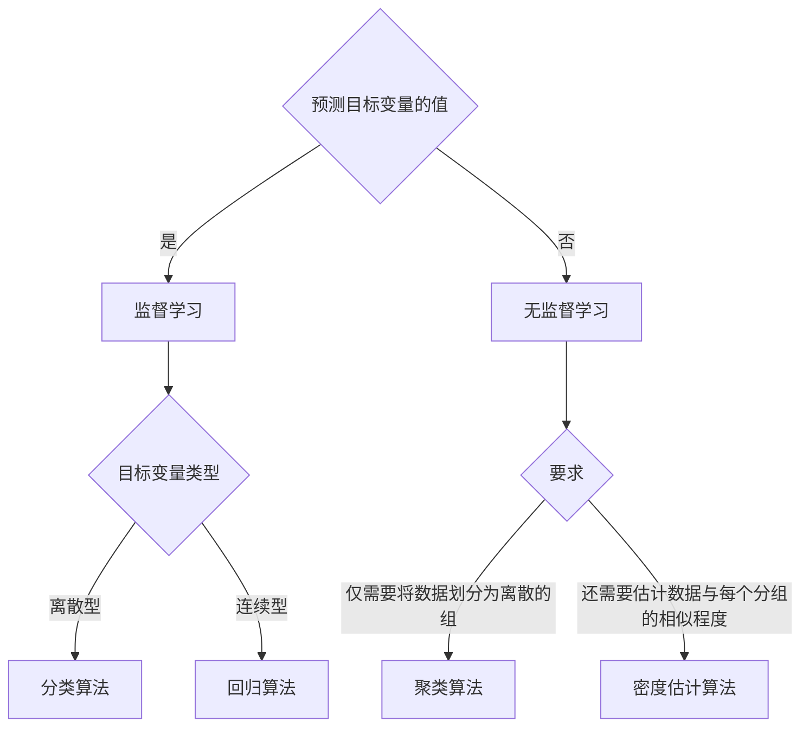

# 机器学习基础

## 什么是机器学习

机器学习就是把无序的数据转化为有用的信息。

机器学习对于任何需要解释并且操作数据的领域都有所裨益。

在现实中，不是每个问题都存在确切的解决方式；很多时候，我们无法透彻的理解问题，或者没有足够的计算资源为问题精确建立模型，这时候、我们就需要统计学工具。

移动计算和传感器产生的海量数据需要机器学习来从中提取出有价值的信息。

有助于我们针对具体的任务搞懂所有相关数据的意义所在、不在数据中迷失。

## 关键术语

测量的某种值称为`特征（attribute）`或者`属性（property）`。

具有相关特征的某个对象称为`实例`。

`专家系统`是一种模拟人类专家解决领域问题的计算机程序系统。

`特征`主要有连续的`数值型`和离散的`标称型`。

机器学习的主要任务就是`分类`。

使用某个机器学习算法进行分类，首先需要进行`算法训练`，即学习如何分类：通常为算法输入大量已分类数据作为算法的`训练集`。

每个`实例`除了具有一系列特征之外，还具有某些`目标变量`，它是机器学习学习算法的预测结果。
 
在`分类`算法中的目标变量的类型通常是`标称型`的，在`回归`算法中的目标变量通常是数值型的。

通常将分类问题中的目标变量称为类别，并假定分类问题只存在有限个数的类别。

为了测试机器学习算法的效果，通常使用两套独立的样本集：训练数据和`测试数据`：学习程序开始运行时，输入训练样品集，训练完成后使用测试样品集。测试样品不提供目标变量。

`知识表示`：某些算法可以产生容易理解的知识表示，某些算法的知识表示只能为计算机所理解。

## 机器学习的首要任务

机器学习的另一项任务是`回归`，主要用于预测数值型数据。

分类和回归属于`监督学习`，因为这类算法知道必须预测什么。

`无监督学习`：数据没有类别信息，也不会给定目标值。

在`无监督学习`中，将数据集合分成由类似的对象组成的多个类的过程称为`聚类`；将寻找描述数据统计值的过程称为`密度估计`；无监督学习还可以减少目标的维度。

| 监督学习方法 | 用途    |
| ------    | ------   |
| k-近邻算法 |  线性回归 |
| 朴素贝叶斯算法 | 局部加权线性回归 |
| 支持向量机 | Ridge 回归  |
| 决策树|Lasso最小回归系数估计 |

| 无监督学习方法 | 用途 |
| ------ |------|
| k-均值 | 最大期望算法 |
| DBSCAN | Parzen 窗设计 |

## 如何选择合适的算法

主要考虑的两个问题

1. 使用机器学习算法的目的，想要算法完成何种任务？

2. 需要分析或者搜集的数据是什么？

    - 特征值是离散值还是连续值？
    - 特征值中是否存在缺失的值？
    - 何种原因造成缺失值？
    - 数据中是否存在异常值？
    - 某个特征发生的频率如何？

## 开发机器学习应用程序的步骤

本书学习和使用机器学习算法开发应用程序，通常遵循以下步骤：

1. 收集数据：可以使用多种方法收集样本数据 —— 制作网络爬虫从网站上抽取数据；从 RSS 反馈和 API 中得到信息；设备发过来的实测数据；使用公开的数据源。
1. 准备输入数据：得到数据之后，需要确保数据格式符合要求，可以使用标准数据格式融合算法和数据源。如 Python 中的 List ；此外还需要为机器学习算法准备特定的格式。
1. 分析输入数据：人工分析之前步骤得到的数据 —— 查看是否为空值？是否可以识别出模式？是否存在明显的异常值？通过图形展示数据？ —— 如果数据来源值得信任，可以跳过该步骤。由于该步骤需要人工干预，可以认为该步骤降低了系统的价值。
1. 训练算法：将格式化的数据输入算法，从中抽取到知识或者信息，得到知识需要储存为计算机可以处理的格式 —— 如果使用无监督学习，由于不存在目标变量值，不需要训练算法，所有算法相关的内容集中在测试中（？？）
1. 测试算法：将实际使用第四步机器学习得到的知识信息。监督学习评估算法的目标变量值；无监督学习，使用其它手段检验算法的成功率。不满意输出结果，可以跳回到训练算法步骤；若问题与数据的收集和准备有关，需要跳回到第一步重新开始。

## Python 的优势

- 语法清晰
- 易于操作纯文本文件
- 使用广泛，存在大量开发文档

## NumPy 函数库基础

略

