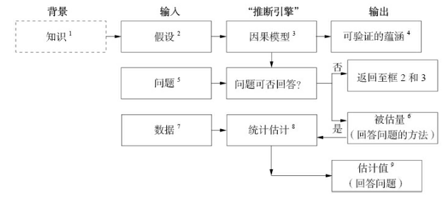

# 思维胜于数据

## 1. 案例：一些看似简明的问题

- 一种特定的疾病在预防某类疾病方面的效果如何？
- 是新的税法的颁布还是层出不穷的广告推销活动导致了销售额的增长？
- 由肥胖引发的医疗保健成本的增长的总体占比为何？
- 雇用记录是否证明雇主实施了涉及性别歧视的招聘政策？
- 我打算辞掉工作。我究竟该不该这么做？

## 2. 统计学与因果推断

统计学只允许表达 X 与 Y “相关”或者“存在关联”

统计学唯一的关注的就是如何总结数据，而不关注如何解释数据

在科学和商业领域，仅凭数不足以解决问题的情况一再发生。多数热衷于大数据的人仍然选择盲目地继续追捧以数据为中心的问题的解决方式

## 3. 因果关系演算法：

### 3.1 因果图（causal diagrams）
    
用以表达我们已知的事务。因果图是由简单的点和箭头组成的图，它们能被用于概括现有的某些科学知识。

点代表了目标量，称为“变量”；箭头代表这些变量之间已知或者疑似存在的因果关系。

### 3.2 类似代数的符号语言：

用以表达我们想知道的事物。

案例：如果我们感兴趣的是药物 $D$ 对病人生存期 $L$ 的影响，那么我们的问题可以用符号写成：$P(L|do(D))$

$do$ 表述了一个干预（intervention）或者处理（treatment）的概念，称为干预算子。它确保观察到的变化能完全归因于原因本身。

### 3.3 反事实思考（counterfactual）

案例：假设乔在服用药物 $D$ 一个月后死亡，那么我们关注的问题就是这种药物是否导致它的死亡。为了回答这个问题，我们需要想象这样一种情况：加入乔在即将服药时改变了主义，他现在会活着吗？

反事实推理涉及假设分析，what-ifs，这可能会引发一些质疑。经验观察无法证实活着反驳这些问题的答案，然而人类一直在对哪些事可能发生或哪些事可能已经发生作出极为可靠、可重复的判断。

反事实思考其共识来源于一种事实：共享同一因果模型的两个人也将共享所有的反事实判断。

### 3.4 现实的蓝图：

#### 示意图：

注释：因果推断引擎能够将数据和因果知识相结合生成目标问题的答案。虚线框不是引擎的组成部分，但他是构建引擎的必要基础。箭头也可以从方框4和方框9指向方框1，这里为简化图示进行了省略。

#### 成分：

三种输入：假设、问题和数据

三种输出：

- 是/否判断：用于判定在现有的因果模型下，假设我们拥有完美的、无限的数据，那么，给定的问题在理论上是否有解。
- 如果答案为是，则推断引擎会生成一个被估量。这是一个数学公式，可以被理解为一种能从任何假设数据中生成答案的方法。
- 最后，在推断引擎接收到数据输入后，它将用上述方法生成一个问题答案的估计值，并给出对该估计值的不确定性大小的统计估计。

#### 解释：

1. 知识指的是推理主体过去的经验。知识周围的虚线框表示它仍然隐藏在推理主体的思想中，尚未在模型中正式表达。
2. 假设是研究者在现有的知识的基础上认为有必要明确表达出来的陈述。
3. 因果模型有多种表现形式，包括因果图、结构方程、逻辑等。
4. 以因果模型的路径来表示的变量之间的听从模式通常会导向数据某种显而易见的模式或者相关关系。这些模式可被用于测试模型，因此被称为“可验证的蕴含（testable implications）”。即 $D$ 和 $L$ 之间没有连接路径翻译成统计学语言，为 $D$ 和 $L$ 之间相互独立。若实际数据与之相互抵触，则修改模型。
5. 向因果引擎提交的问题即希望获得解决的科学问题。
6. 被估量（estimand）是从数据中估算出来的统计量。具有概率公式的表现形式，实际上可以让我们根据所掌握的数据类型回答因果问题。
    - 若 $D$ 和 $L$ 都依赖第三变量 $Z$，且无法收集 $Z$ 的值，则问题就无法得到解答。
    - 需要完善模型，可以通过输入新的知识或者简化假设（可能存在失败的风险）
7. 数据是填充被估量的原料，而其本身不具备表述因果关系的能力。被估量可以将这些统计量转化成表达式。
8. 得到的估计值只是近似值。可以通过诸如机器学习领域提供的先进技术来应对近似结果的不确定性。
9. 最后，如果模型正确且数据充分，则获得待解决的因果问题的答案。

#### 更多

必要的前提：根据假设确定了因果模型，提出需要解决的科学问题，推导出被估量，才会收集数据。

机器人与为什么：要使得机器人能够回答为什么，必须运用因果模型使得其学会如何回答反事实问题。