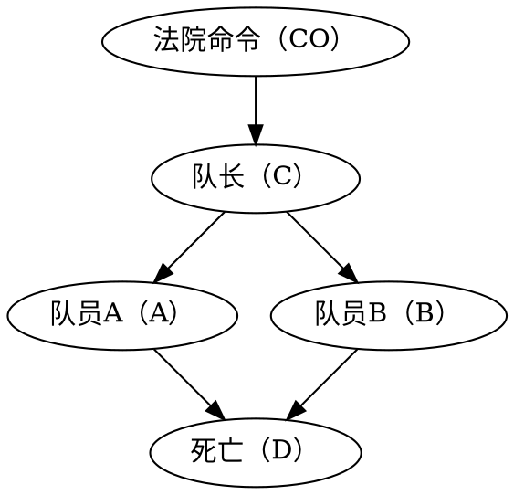

# 因果关系之梯

## 1. 亚当和夏娃：早期人类的因果意识

> 上帝发现亚当躲在花园里，便问他：“我禁止你碰那棵树，你是不是偷吃了它的果子？”亚当答道：“你所赐给我的与我做伴的女人，她给了我树上的果子，我就吃了。”“你都做了什么？”上帝问夏娃。夏娃答道：“那蛇欺骗了我，我就吃了。”

观察：上帝询问的是 “什么”，得到的回答是 “为什么”。
思考：这种认为列举原因可以美化行为的想法的来源？

- 人类意识到世界并非由简单的事实（数据）组织，事实是通过错综复杂的因果关系网络融合在一起的
- 因果的解释而非枯燥的事实构成了绝大多数的知识
- 从数据处理者向因果解释者的变化不是自发而渐进的，而是依赖某种其它的外部条件的推力而产生的跃进

思维的主体要完成大型的任务，必须进行预先规划，具备一个可供参考并且可以自主调整的关于主题的心理模型。构建的模型中，含有多种原因或者影响因素。

主体可以通过对模型局部的修改来试验不同的情境，对影响因素进行评估。

## 2. 因果关系的三个层级

因果关系的学习者必须熟练掌握至少三种不同层级的认知能力：

1. 观察能力（seeing）
    - 发现环境中规律的能力
    - 许多动物和早期人类共有
2. 行动能力（doing）
    - 预测对环境进行刻意改变后的结果，根据预测结果选择行为方案以催生出自己期待的结果
    - 只有少数五种表现具备此种能力的特征
    - 有意图的工具使用可以视为达到该层级的特征
3. 想象能力（imagining）
    - 告知工具有效的理由，如果无效该怎样做

### 2.1 观察能力（关联）

概述：

- 活动：看、观察
- 问题：
    - 变量之间的关联是怎样的？
    - 观察到 $X$ 会怎样改变我对 $Y$ 的看法？
- 例子：
    - 某一症状告诉我关于疾病的什么信息？

较低等级的能力，大部分的机器学习算法局限在该级别，如果观察到某一事件改变了观察另一事件的可能性，称这一事件与另一事件相关联。

测量当观察到某一事件时另一事件发生的可能性的概率称为 “条件概率”。

## 2.2 行动能力（干预）

概述：

- 活动：行动、干预
- 问题：
    - 如果我实施 $X$ 行动，那么 $Y$ 会怎样？
    - 怎样让 $Y$ 发生？
- 例子：
    - 如果吃了阿司匹林，我的头痛能够治愈吗？
    - 如果我们禁止吸烟会发生什么？

## 2.3 想象能力（反事实）

概述：

- 活动：想象、反思、理解
- 问题：
    - 是 $X$ 引起了 $Y$ 吗？
    - 假如 $X$ 没有发生会如何？
    - 假如采取其它的行动会如何？
- 例子：
    - 是阿司匹林治好了我的头痛吗？
    - 假如奥斯沃德没有刺杀肯尼迪，肯尼迪会活着吗？
    - 假如在过去的两年里我没有吸烟会怎样？

## 3. 迷你图灵测试

### 3.1 迷你图灵测试

作者按照图灵测试的测试提出了一种简单的“迷你图灵测试”。主要思路是选择一个简单的故事，用某种方式将其编码输入机器，测试机器能否正确回答人类能够回答的与之相关的因果问题。

之所以称之为迷你，因为：

- 该测试仅限于测试机器的因果推理能力
- 允许参赛者以任何认为便捷的表示方法对故事进行编码

在让机器进行迷你图灵测试的准备阶段，表示问题必须优先于获取问题。如果缺少表示方法，则不知道如何存储信息以供将来使用，机器人也无法记住学到的信息。

对于认为可以靠记住答案来作弊的质疑，只要设计涉及足够大变量的问题，则可以破解。

作者认为，对于人类，因果图是一种可能的表示信息和提取答案的模型。

### 3.2 行刑队问题

对于因果图，可以回答：

- 如果犯人死了，是否意味着法院已经下令处决犯人？搜索路径 -> 是
- 如果犯人死了，发现 $A$ 可能射击了，反映了什么问题？$B$ 可能开枪也可能没开枪。
- 如果 $A$ 决定开枪，结果如何？一定死亡

还能回答反事实问题：

- 犯人死了，两位队员都开枪了，那么如果其中一位不开枪，犯人是否会死亡？会死亡 —— 因此每个队员个人的是否开枪不是充要原因，可以减轻心理负担。

### 3.3 天花疫苗

尽管天花疫苗造成的副作用造成了部分死亡，但是总体上拯救了多的多的人。因此为因果问题引入概率和量化是必要的。

环境的因素会导致变量的分布产生极大的变化，但是因果图的机构却仍然保持不变。被估量仍然保持不变。

## 4. 论概率和因果

