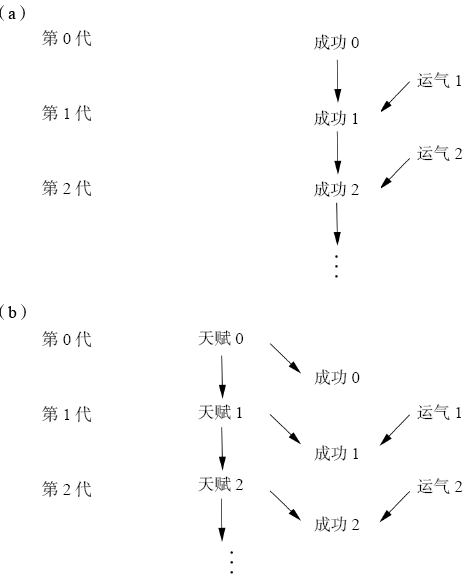
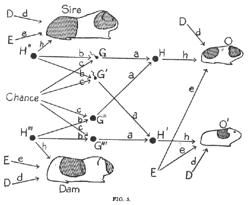
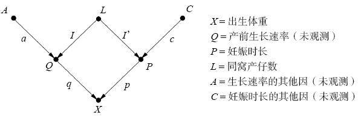

# 从海盗到豚鼠

从海盗到豚鼠：因果推断的起源

## 1. 引言

高尔顿的发现：

1. 高尔顿爵士通过高尔顿板发现小球会向均值回归。该定理被拉普拉斯证明 —— 任何此类随机过程的总效果都会导向相同的概率分布，这种概率分布被称为正态分布，称之为中心极限定理。
2. 高尔顿发现人的身高也会遵循这个规律，随机漂变后几代内向中心靠拢。他还像研究优秀家族的后代是否能继承这种优秀性。他认为向中值回归的现象是遗传学效应而非统计学效应。
3. 最终高尔顿发现，在进行代际比较时，向均值回归的时间顺序可以逆转。

高尔顿提出了相关性概念，该概念首次在不依赖人的判断和解释的前提下以客观度量的形式说明了两个变量是如何关联的。这两个变量可以是因果的、互相独立的或反因果的关系。

## 2. 高尔顿与被丢弃的探索

高尔顿以寻找因果关系为起点，最终发现了相关性 —— 无视因果的关系。实际上，根据该实验可以画出以下的因果图：

两种模型都与身高的钟形分布相兼容，但是第一种模型不代表身高成功代际分布的稳定性。而第二种可以解释。

在该后续几代发展过程中，统计学逐渐变成一个模型盲、以数据约简为其主要事业的学科。

## 3. 皮尔逊：狂热者的愤怒

皮尔逊是高尔顿的思想的延续者。在他的眼中，因果关系被简化为仅仅是相关关系的一个特例，其相关系数为 1 或者 -1。他将这种信仰贯穿一生，直至狂热。

皮尔逊发现一种伪相关性 —— 将两个不同组别的总体结合在一起，就能产生数值上的 “伪相关”。作者认为，实际上，在某些情况下，正确的分析结果只能来自于聚合数据，而非分组数据。

皮尔逊的学生发现了贫困率的提高可以归因于院外救济，但是由于皮尔逊和追随者对因果关系深怀敌意，他害怕正面挑战。

## 4. 休厄尔·赖特、豚鼠和路径图

赖特在美国农业部的早期研究发现，豚鼠的毛色遗传和孟德尔的遗传定律相抵触。他开始怀疑控制毛发白色素的数量是由某个基因独立控制的，并提出一种假设：是母鼠子宫内存在的某种 “发育因子“ 导致了这些特征的变异。

赖特的路径图和实验，首次证明了 “相关关系不等于因果关系” 这个判定应该让位于 “某些相关关系确实意味着因果关系”。

路径图不仅是一张漂亮的画图，更是一个强大的计算工具，因为计算相关关系的规则就是追踪连接两个变量的所有路径，并沿着所有路径系数相乘。另外还需注意，箭头缺失所蕴含的假设实际上比箭头存在所蕴含的假设更重要。两个变量间箭头缺失这一事实将二者的因果效应限制为零，而箭头存在这一事实并不能告诉我们因果效应的大小具体为何（除非我们事先对路径系数赋值）。该方法遭到皮尔逊的后继者尼尔斯的贬损。

## 5. “但它仍在动”

赖特没有陷入自我怀疑，因为他确切的意识到他可以借助自己的方法回答借助其他任何方法都无法回答的问题。

他通过路径图回答了妊娠时长对于出生时小鼠体重的直接效应是什么的问题。

最终赖特得出了问题的结论。通过该实验，我们可以得到两个经验：

- 因果分析允许我们量化在现实世界中实际存在的某个过程，而非只能分析数据中的模式
- 无论是否采用数学处理，在路径分析中，都能通过检查整个路径图得出关于单个因果关系的结论。而如果想要测算某个具体的路径系数，则需要进一步地分析整个路径图的整体结构

同时代的研究者指出：由于路径分析不适合解决包含固定程序的问题。其使用者必须先有一个假设，并设计出一张恰当的、包含多重因果序列的结构图。

皮尔逊和高尔顿之后的统计学界领袖费舍尔认同因果分析绝不是仅对数据的分析，在因果分析中，必须将对数据生成过程的理解体现出来，并据此得出初始数据不包含的内容。但他不同意赖特的理论。

20世纪60年代，一群社会学家，重新发现了路径分析，将其作为预测社会政策和教育政策实施效果的有效方法。路径分析在经济学和社会学中有着不同的轨迹，但都走向对赖特思想的背叛：

- 社会学家将路径分析改名结构方程建模（structural equation modeling，SEM），将路径分析变成了一套生搬硬套的事情
- 在经济学领域，路径分析的代数部分编程联立方程模型（simultaneous equation models），他们几乎完全舍弃了路径图，更多地借鉴了数值方程和矩阵代数方面的内容。由于代数方程没有方向性，经济学家也就无法利用符号表示法来区分因果关系和回归方程，无法回答与估计策略效果有关的问题

20世纪90年代，赖特重新回顾了其理论。但是几十年中，其理论几乎没有任何进展。

赖特反驳了卡林的观点，后者反对路径分析，认为：“路径分析的前提假设是其为线性关系的；最有效的方法是运用一套无模型的方法，借助一系列指标来理解数据。” 而赖特意识到了 “无模型方法” 中蕴含的巨大风险：“卡林等人将无模型方法作为首选的替代方案……他们所要求的不仅是方法的改变，还包括放弃路径分析的本来目的，忽略对各种因的相对重要性的评估。因为没有模型，我们就不可能进行此类分析。对那些需要进行这种评估或分析的人，他们给出的建议就是：放弃吧，去做别的事情。”

## 6. 从客观性到主观性 —— 贝叶斯连接

赖特一再地指出，他不希望路径分析变成 “陈规俗套”，认为 “路径分析这种灵活的方法与为尽可能偏离客观性而设计的刻板的描述统计方法有很大的区别”，暗示：

路径分析的应用应该以研究者对因果过程的理解为基础，这种理解就反映在其绘制的因果路径图中。不能简化为一个机械性的程序。

大部分统计工具都力求完全客观，而对于这一标准，贝叶斯统计则层被认为是一种异端学说。贝叶斯分析的原型是 $先验判断 + 新的证据 -> 经过修正的判断$，它提供了一种将观察到的证据与我们已有的相关知识结合起来以获得修正后判断的客观方法。

由于贝叶斯理论使用了概率语言，最终贝叶斯学派和频率学派实现了和解。但是因果图中包含的语言上的障碍却并不容易被跨越。此外，随着数据量的增加，因果信息中的主观成分也不一定会随着时间的推移而减少。不同的假设面对同一组数据可能得出不同的结论，但是换句话说，以为者只要两个人可以就假设一致，它们就可以使用 “客观的” 方法解释任何出现的新证据。