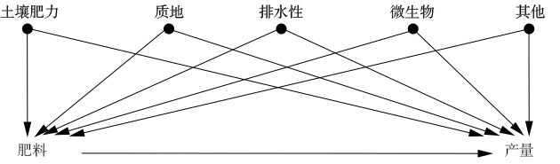
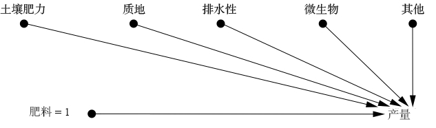
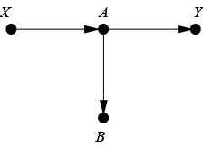
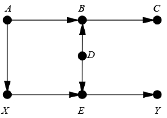
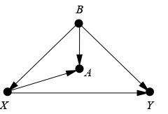
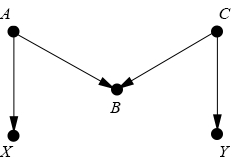
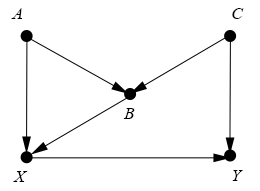

# 混杂和去混杂

混杂和去混杂；或者，消灭潜伏变量

## 1. 引言

### 1.1 巴比伦王宫里的对照实验

#### （1）丹尼尔的方法论

组织两组人，保证在所有相关方面的特征都相同或者相似。给一组人新的处理，而对另一组人要么给予以前的处理，要么不给与任何处理。经过一段适当的时间之后，可以看到这两组各方面条件假定相同的人之间出现了可测量的差异，那么新的处理就必然是差异的因。这类实验称为对照实验（controlled experiment）。

#### （2）方法的特点

1. 小组间比较
2. 两组人可比较，代表的是某一总体
3. 忽略了混杂偏倚（confounding bias）

### 1.2 混杂

当一个变量同时影响到选择接受处理的对象和试验结果时，混杂偏倚就产生了。

#### （1）高估的混杂因子的统计调整

当今时间的绝大多数方法：控制能测量的一切 —— 一种可轻松遵循的、便捷的、简单的程序，但是既浪费资源又错漏百出。

#### （2）“正确的控制”

如果在因果图中确定了去混因子（deconfounder）的充分集，收集它们的数据，并对它们进行适当的统计调整，此时即为“计算出了那些因果效应 $X \rightarrow Y$ ”。

### 1.3 本章的目标

因果图使分析重心从混杂因子向去混因子的转变成为可能：确定应该控制哪些变量，使其成为去混因子 —— 后门准则（back-door criterion）。实际上，后续将会讲述在不真正实施干预的情况下对干预的结果做出预测；且在没有去混因子充分集的数据，也可以控制混杂。

## 2. 对混杂的长期恐惧

### 2.1 退休男子散步习惯与其死亡率下降的关系

#### （1）实验和混杂

研究散步强度与死亡率下降的关系，其中可能的混杂如下图所示：

#### （2）一种谨慎而普遍的态度

远远超过了样本同质性和样本规模问题 —— 一项观察性研究（受试者自行选择是否接受处理）永远不能阐明一个因果结论。**作者认为过于夸张。**

### 2.2 作者的观点

1. 假设在所发现的关系中，不存在其他混杂因子发挥主要作用。
2. 未来的研究应侧重于寻找其他的影响因子，而不是当前研究中被控制的这些因子。
3. 随机对照试验自身也存在局限性。掌握既定结论背后的假设比试图用随机对照试验来规避这些假设更有价值。

## 3. 对自然的巧妙询问：随机对照试验为何有效

### 3.1 随机对照实验的评价

#### （1）作者的看法

在随机对照试验中，我们想问的问题的答案确实存在于自然界中。我们的实验是发现答案的粗略方法，而不能以任何方式明确定义对应答案。

其中，随机化处理是为引出这个问题的答案而采取的一种认为手段。

得到对正确问题的不确定答案比得到对错误问题的高度确定的答案好得多。

#### （2）两个优点

1. 消除了混杂偏倚
2. 使得研究者能够量化不确定性

### 3.2 案例

错误的对照实验模型：

想知道的世界：

此时决定使用何种肥料时只听从于抽签结果，以使得所有旧的混杂因子都失效。

## 3. 混杂的新范式

### 3.1 混杂的问题

由于缺乏对混杂本质的清晰理解，科学家无法在物理控制处理行不通的观察性研究中给出任何有意义的陈述。

### 3.2 混杂的替代定义

说明：

1. 声明性定义：混杂因子是与 $X$ 和 $Y$ 都相关的任何变量。
2. 过程性定义：试图根据统计检验来描述混杂因子的特征。

案例：

1. 过程性定义：
    - “非溃散性（noncollapsibility）”：在形式上，可以将天然的相对死亡风险和根据潜在混杂因子进行统计调整后得到的相对死亡风险进行比较。二者的差异表明混杂存在，在这种情况下，应该使用调整后的相对死亡风险评估结果
2. 声明性定义：
    - “流行病学定义”，处理 $X$ 和结果 $Y$ 的一个混杂因子 $Z$，满足以下条件。例如 $X \rightarrow M \rightarrow Y, M \rightarrow Z$ 的情形，以上的方法可能将 $Z$ 作为混杂因子，因为控制 $Z$ 实际上也控制了 $M$ 此时，不会对 $Y$ 产生因果影响。因此: <cite> 除非你有一个 “令人信服的先验理由” 相信 $Z$ 不受 $X$ 的影响，否则就不应该控制 $Z$。</cite>
        - 在整个总体上与 $X$ 相关
        - 在未接收处理 $X$ 的人群中与 $Y$ 相关
        - $Z$ 不应当出现在 $X$ 和 $Y$ 之间的因果路径上（后续添加的）
    - “可互换性”：对照组应与处理组进行比较，要求研究者针对处理组，想象如果这组患者没有得到处理，其成员会发生什么，然后判断这一想象中的结果与那些实际上没有接受处理的小组是否一致。只有二者一致才能说明这项研究中不存在混杂。

**问题的解决**：对混杂进行操作测试，称为 “后门准则”。

## 4. do 算子

### 4.1 基本规则

**重要前提**：非因果路径恰恰是混杂的根源。do 算子会清除指向 $X$ 的所有箭头，可以防止有关 $X$ 的任何信息在非因果方向的流动。

1. 在链接合 $A \rightarrow B \rightarrow C$ 中，控制 $B$ 可以防止有关 $A$ 的信息流向 $C$ 或者有关 $C$ 的信息流向 $A$。
2. 在叉接合或者混杂接合 $A \leftarrow B \rightarrow C$ 中，控制 $B$ 可以防止有关 $A$ 的信息流向 $C$，或者有关 $C$ 的信息流向 $A$。
3. 最后，在对撞接合 $A \rightarrow B \leftarrow C$ 中，信息流通规则与前两种相反。变量 $A$ 和 $C$ 原本完全独立，所以关于 $A$ 的信息不能告诉关于 $C$ 的信息。但是，如果控制 $B$，由于辩解效应的存在，信息就会开始在 “管道” 中流通。
4. 控制一个变量的后代节点或者替代物，就如同部分地通知变量本身。控制一个中介物的某个后代节点意味着部分地关闭信息管道；控制一个对撞变量的某个后代节点意味着部分打开了信息管道。

为了去除 $X$ 和 $Y$ 中的混杂，只需要阻断它们之间的每个非因果路径，而不去阻断或者干扰所有的因果路径就可以了。更确切地说，后门路径（back-door path）定义为所有 $X$ 和 $Y$ 之间以指向 $X$ 的箭头为开始的路径。

如果阻断了所有的后门路径，以避免这些路径允许 $X$ 和 $Y$ 之间的伪相关信息在管道中流通，则完成了对 $X$ 和 $Y$ 的去混杂。如果试图通过控制某一组变量 $Z$ 来实现这一点，那么还需要确保 $Z$ 的任何成员都不是 $X$ 的后代，否则可以部分地或者完全地关闭这条 $X$ 与 $Y$ 之间的因果路径。

### 4.2 基本案例

下图的这种情况，$X$ 和 $Y$ 之间不存在后门路径，无需且不应该控制 $B$ 变量。

 

下图的这种情况，存在后门路径 $X \leftarrow A \rightarrow B \leftarrow D \rightarrow E \rightarrow Y$，但该路径被对撞接合阻挡，不需要且不应该控制事件。

下图的情况，存在 $X \rightarrow A \leftarrow B \rightarrow Y$ 和 $X \leftarrow B \rightarrow Y$ 两条后门路径。前者存在对撞接合，舍弃；后者可以连通，需要控制变量 $B$。

下图的情况，存在 $X \leftarrow A \rightarrow B \leftarrow C \rightarrow Y$ 的后门路径，但是在 $B$ 处存在对撞接合，需要舍弃。因此该情况无需控制变量 $B$。要想控制 $B$ 需要控制 $A$ 或者 $C$，来关闭被 $B$ 打开的信息管道。

下图的情况，存在后门路径 $X \leftarrow B \leftarrow C \rightarrow Y$ 和 $X \leftarrow A \rightarrow B \leftarrow C \rightarrow Y$，如果控制 $B$ 来关闭前者，则后者的对撞接合会被重新打开，还需要再关闭 $A$ 或者 $C$ 才能控制通道的流动。因此可以仅关闭 $C$ 更有效率。

  