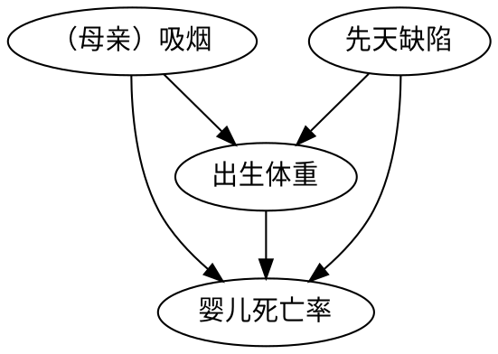

# 烟雾缭绕的争论

烟雾缭绕的争论：消除迷雾，澄清事实

## 1. 烟雾缭绕的争论

争论：20 世纪 50 年代末 60 年代初，统计学家和医生就整个 20 世纪最引人入目的一个医学问题产生了意见冲突：吸烟会导致肺癌吗？

- 随机对照实验在吸烟案例中，既不可行也不符合职业道德
- 吸烟不是肺癌的充分或者必要因 —— 许多人吸了一辈子的烟也没有产生肺癌，有些从未吸烟的人患上了肺癌
- 可能存在一种潜伏的第三因素

## 2. 烟草：一种人为的流行病

### 2.1 原因和背景

烟草流行的原因：

1. 自动化，由于实用性强和成本低廉，机器制造的香烟轻松战胜了手工制造的雪茄和烟斗。
2. 广告，烟草业开创并完善了很多广告销售技巧。

背景：

- 随机对照试验在链霉素应用于结核病中发挥了很大作用，但在肺癌中不适用
- 在烟草大发展的过程中，肺癌的发病率也大幅度上升
- 在同一时段中，许多其它的事情，例如道路铺设、含铅汽油尾气的排放和普遍空气污染，也可能是普遍因

### 2.2 实验和争论

（1）多尔和希尔的研究

多尔和希尔的研究，将病历与对照组进行了比较，因此这种类型的研究也被称为 “病历-对照研究”（case-control study）。

- 研究人员可以控制一些混杂因子，有进步性
- 是回顾性研究，意味着要在已知研究对象的前提下反向找出原因，且概率逻辑也是反向的
- 多种偏倚来源：
    - 回忆偏倚，虽然确保采访者不知道其采访对象是否患有癌症，但是事实肯定会影响他们的回忆
    - 选择偏倚，已入院的癌症患者绝不是整个人口总体的代表性样本，甚至不能作为吸烟者总体的代表性样本

偏倚消除的尝试 —— 对六万名英国医生发放调查问卷，采集关于其吸烟习惯的信息，并对它们进行追踪调查。得出了相对一致的结论：吸烟越多，患肺癌的风险越高，戒烟能够降低这种风险。这类结论被称为 “剂量 —— 响应效应”（dose-response effect）。

（2）体质假说

可能存在某种遗传因子同时导致对尼古丁的渴望和肺癌发生率。

（3）反体质论证

假设存在一个混杂因子，完全地解释了吸烟者患肺癌的风险。如果吸烟者患肺癌的概率为常人的 9 倍，那么在吸烟者中，这种混杂因子存在的概率也应该比常人高 9 倍。从数学上，“吸烟基因” 不可能完全解释吸烟和癌症之间的相关。对生物学家，称之为 “康菲尔德不等式”（Cornfield's inequality）。

### 2.3 敏感度分析

该分析方法的使用者不是通过假设模型中缺少某些因果关系进行进一步地推断，而是对这些假设直接提出挑战，并评估在解释所观察到的数据时，新的假设所内含的相关性应该达到怎样的强度，之后对定量结果进行似然性判断。

## 3. 美国卫生局局长委员会和希尔标准

由于科学家不具备对 “导致” 这个词的明确定义，也无法在随机对照实验不适用的情况下确定因果效应，对于这种情况被迫地寻找一个定义。

### 3.1 标准定义

美国卫生局局长委员会的定义如下：

1. 一致性：在针对不同目标总体的多项研究中得到了类似的结果
2. 关联强度：包括存在剂量 - 响应效应 —— 吸烟多于更高地肺癌患病风险相关
3. 关联的特异性：一个特定的病原体应该有一个与之对应的特殊效果，而非带来一连串的影响
4. 时序关系：果应该跟随因
5. 连贯性：具有生物学合理性和其他类型的证据的一致性

### 3.2 标准反驳和存在的问题

此后又附加了四条，它们不是强制要求。因为可能存在下述情况：

1. 一致性：相同的偏倚
2. 关联强度：叉接合的情况
3. 特异性：在传染病研究的上下文中有效，涉及环境因素的研究中可能无效
4. 时序关系：公鸡打鸣不是太阳升起的理由
5. 连贯性：已有事实并不可靠

存在的问题：其指导方针既不清晰也不周密。

## 4. 吸烟对新生儿的影响

吸烟的母亲其新生儿体重较轻，但是存活率却较不吸烟的母亲的新生儿较高。

引发争论的因果路径：$吸烟 \rightarrow 出生体重 \rightarrow 婴儿死亡率$。实际上的路径：

## 5. 激烈的辩论：科学与文化

流行病学家艾伦·韦尔考克斯的问题：如何知道低出生体重才是导致婴儿死亡的直接原因？

说明：

- 删除 $出生体重 \rightarrow 婴儿死亡率$ 的箭头，对撞仍然存在，可以解释悖论
- 研究的因果变量可能存在社会问题