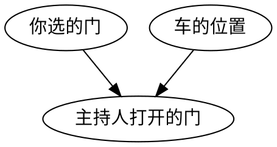
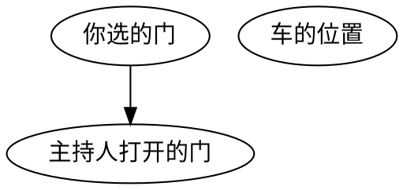
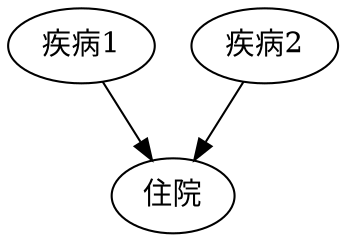
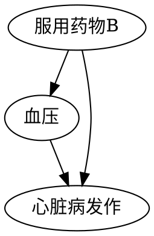
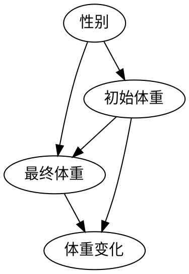
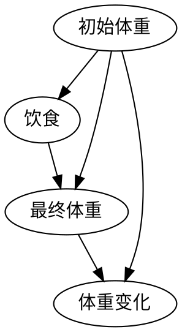

# 大量的悖论

## 1. 令人费解的蒙提·贝尔悖论

### 1.1 问题描述

三扇门后有一辆汽车、两只羊，参与者选择一扇门后，主持人会打开一扇有羊的门，参与者可以选择保持或者更换门。问哪种选择概率较高？

当主持人有意选择时，其因果图如下：

当主持人随机选择时，其因果图如下：

实际是选择换门概率为 $\frac{2}{3}$，高于不换门的 $\frac{1}{3}$

## 2. 更多的对撞偏倚：伯克森悖论

伯克森悖论：两种疾病即使在一般人群中彼此不存在实际联系，在医院的病人中也会形成某种似是而非的关联。

伯克森悖论的因果图：

说明该结构实际上一种对撞结构。

## 3. 辛普森悖论

处理组的男性发病率大于对照组，处理组的女性发病率大于对照组，但是总发病率小于对照组。

### 3.1 辛普森逆转

在合并样本时，两个或者多个不同的样本关于某一特定事件的相对频率出现反转。即 $\frac{A}{B} < \frac{a}{b}, \frac{C}{D} < \frac{c}{d}, \frac{A+B}{C+D}>\frac{a+b}{c+d}$。

### 3.2 辛普森悖论

辛普森悖论提醒我们：至少存在一个统计趋势（无论来自聚合数据、分层数据还是同时来自两者）无法代表真正的因果效应。

### 4. 罗德悖论

### 4.1 体重增重问题 - 男女生版

问题为，罗德假设一所学校想要研究其餐厅所提供饮食的效果，特别是对男生和女生是否有不同的效果。

图示如下：

由于在性别和体重之间没有需要阻断的后门，因此总体数据可以为问题提供该问题的答案：性别对体重变化没有影响。

### 4.2 体重增重问题 - 不同餐厅版

注意：体重较轻的群体倾向选择的餐厅和体重较重的群体倾向选择的餐厅不同。

此时，初始体重会对最终体重和体重变换产生混淆，需要分层。