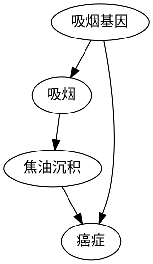
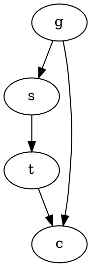
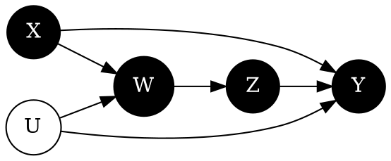
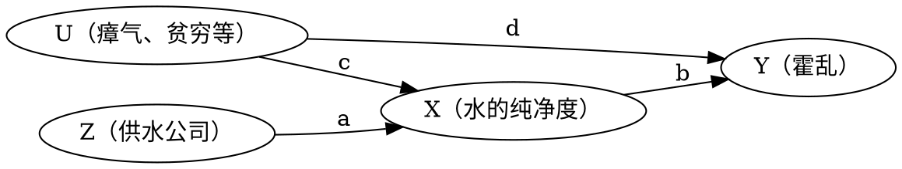
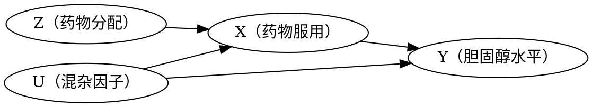
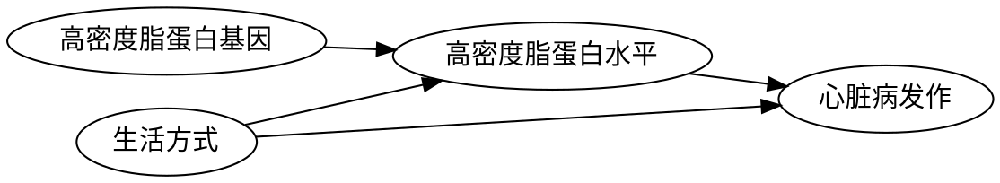

# 超越统计调整

超越统计调整：征服干预之峰

## 1. 前言

混杂因子是导致混淆 “观察” 和 “干预” 的主要障碍。在用 “路径阻断” 工具和后门准则消除混杂因子的障碍后，就可以精确绘制出登上干预之峰的路线图。新手最安全的路线是后门调整和由此衍生的诸多同源路线，包括：

- 工具变量
- 前门调整

此外，还能够使用 do 演算（do-calculus）的方法，允许研究者探索并绘制通往干预的可能路线。

## 2. 最简单的路线：后门调整公式

### 2.1 前提

确信自己已经掌握了变量的一个充分集（称之为去混因子）的数据可以用来阻断干预和结果之间所有的后门路径，那么就可以使用此方法。

### 2.2 做法

1. 首先估计去混因子在每个 “水平” 或者数据分层中产生的效果
2. 计算这些层的加权平均值，为此需要对每个层都按照其在总体中的分布进行加权

后门准则所起的作用是，保证去混因子在各层中的因果效应与在该层中观察到的趋势一致。如此一来，可以从数据中逐层估计出因果效应。

### 2.3 分类和问题

在如数值变量或者无限可选值的复杂情况下，一个显而易见的方法是将数值分为有限并且数目可控的类别，但是：

1. 我们对分类方式的选择可能会存在主观性
2. 需要进行的统计调整的变量如果比较多，则类别的数量会指数增长
3. 在分类完成后，我们可能会发现许多层缺乏样本，因此难以地其进行任何概率估计

应对维度灾难问题，统计学家设计使用某种程度的外推法，即通过一个与数据拟合的光滑函数去填充空层所形成的 “洞”。

### 2.4 回归线与混杂

对于无混杂的情况，处理变量 $X$ 和结果变量 $Y$ 之间可以使用回归方程 $Y=aX+b$ 进行拟合。

存在一个混杂因子 $Z$ 的情况下，相关系数 $r_{XY}$ 不能够告知平均因果效应。而在将三个变量的值放在一起绘制点云，使用回归平面表示为 $Y=aX + bY + c$，则可以容易地从数据中计算出 $a$、$b$、$c$。系数 $a$ 给出了 $Y$ 在 $X$ 上的回归系数，并且这两个变量已经根据 $Z$ 进行了统计调整。该回归系数被称之为偏回归系数 $r_{XY.Z}$。

**回归系数有时可以体现因果效应，有时无法体现，而其中的差异无法仅依靠数据来说明。还需要以下条件来赋予 $r_{XY.Z}$ 因果合法性：**

1. 绘制的因果图能合理地解释现实情况
2. 需要根据其进行统计调整的变量 $Z$ 应该满足后门标准
3. 基于回归的统计调整只适用于线性模型

### 2.5 后门准则和后门调整公式

后门准则告知哪些变量集可以用来去除数据中的混杂。统计调整公式是去混杂。

在非参数问题中，必须公开地根据后门调整公式作出统计调整：

- 要么直接对数据进行统计调整
- 要么对数据的某个外推版本进行统计调整

## 3. 前门准则

前门调整（front-door adjustment）。

### 3.1 焦油沉积量与致癌

可能存在以下因果图：

上图中，存在后门路径 $吸烟 \leftarrow 吸烟基因 \rightarrow 癌症$，但是在该路径中，吸烟基因无法测量。因此不能阻断后门路径，也就不能使用后门调整来控制混杂因子的影响。

实际上，此时由于癌症处的对撞，路径 $吸烟 \leftarrow 吸烟基因 \rightarrow 癌症 \leftarrow 焦油沉积$ 已经被阻断。只需要观测 $P(焦油沉积|吸烟)$ 和 $P(焦油沉积|不吸烟)$，二者的差异就是吸烟对焦油沉积的平均因果效应。

为了得到 $焦油沉积 \rightarrow 癌症$ 的因果影响，我们观测到存在后门路径 $焦油沉积 \leftarrow 吸烟 \leftarrow 吸烟基因 \rightarrow 癌症$，且在此路径中，控制吸烟即可阻断信息通道。

则总因果效应公式为：

$$
\begin{aligned}
& P(癌症|do(吸烟)) - P(癌症|do(不吸烟)) = \\
& ( P(焦油沉积|do(吸烟)) * P(癌症|do(焦油沉积)) + \\
& P(无焦油沉积|do(吸烟)) * P(癌症|do(无焦油沉积))) - \\ 
& (P(焦油沉积|do(不吸烟)) * P(癌症|do(焦油沉积)) + \\
& P(无焦油沉积|do(不吸烟)) * P(癌症|do(无焦油沉积)))
\end{aligned}
\tag{式 3-1}
$$

### 3.2 前门准则

上述过程，可以在不引入 do 算子的前提下表示 $P(癌症|do(吸烟))$，被称为前门调整。

$$
P(Y|do(X)) = \sum_Z(P(Z=z, X)\sum_X{P(Y|X=x, Z=z)P(X=x)})
\tag{式 3-2}
$$

其中，$X$ 代表动作 “吸烟”，$Y$ 代表目标变量 “癌症”，$Z$ 代表中间变量 “焦油沉积”，$U$（未出现）代表不可观测的变量 “吸烟基因”。

对比后门调整公式如下：

$$
P(Y|do(X)) = \sum_Z{P(Y|X, Z=z)P(Z=z)}
\tag{式 3-3}
$$

注意：

- 前门调整只能在上述混杂变量与中间变量无连接的情况下使用。
- 在假设正确的情况下，即使没有混杂因子的数据，照样可以使用数学的方式消除混杂因子的影响
- 一旦通过因果图发现面临无解的混杂因子时，应该立即着手寻找不受混杂因子影响的中介变量

在使用后门标准时，如果存在额外的混杂因子，对结果的估测偏差很大。而采用前门准则则可以消除几乎所有的 “动机” 效应。

## 4. do 演算，或者心胜于物

前门调整公式和后门调整公式的最终目标是根据 $P(Y|X, A, B, Z, ...)$ 此类不涉及 do 算子的数据估算干预的效果，即 $P(Y|do(X))$。如果成功消除了计算过程中的 do 概率，那么就可以使用观测数据来估计因果效应。

### 4.1 目标

存在某种方法，可以用来事先确定一个给定的因果模型是否可以用于这种消除处理：

- 如果存在这种方法，那么就可以对适用的因果模型进行此类处理，从而在不进行实际干预的情况下估算因果效应
- 对于不适用的模型，可以知道模型中嵌入的假设不足以让我们仅根据观测数据来揭示因果效应

从目标 $P(Y|do(X))$ 开始，如果能够成功地消除它们的 do 算子，只留下经典条件概率表达式，则任务完成。同时，必须保证进行的操作符合 $do(X)$ 作为一项实际干预行动的基本含义。

### 4.2 公式

#### （1）规则 1：允许增加和删除某个观察结果

如果观察到变量 $W$ 和 $Y$ 无关，那么 $Y$ 的概率分布就不会随 $W$ 而改变。有：

$$
P(Y|do(X), Z, W) = P(Y|do(X), Z)
\tag{式 4-1}
$$

#### （2）规则 2：允许用观察替换干预

如果变量 $Z$ 阻断了从 $X$ 到 $Y$ 的所有后门路径，那么以 $Z$ 为条件（对 $Z$ 进行变量控制），则 $do(X)$ 等同于 $see(X)$。有：

$$
P(Y|do(X), Z) = P(Y|X, Z)
\tag{式 4-2}
$$

#### （3）规则 3：允许添加或者删除干预

如果从 $X$ 到 $Y$ 没有因果路径，就可以将 $do(X)$ 从 $P(Y|do(X))$ 中移除。有：

$$
P(Y|do(X)) = P(Y)
\tag{式 4-3}
$$

### 4.3 案例：前门准则公式推导

$$
\begin{aligned}
P(C|do(s)) &= \sum_t{P(C|do(s))P(t|do(s))}  \\
&=\sum_t{P(c|do(s), do(t))P(t|do(s))} \\
&=\sum_t{P(c|do(s), do(t))P(t|s)} \\
&=\sum_t{P(c|do(t))P(t|s)} \\
&=\sum_{s'}{\sum_t{P(c|do(t), s')P(s'|do(t))}P(t|s)} \\
&=\sum_{s'}{\sum_t{P(c|t, s')P(s'|do(t))}P(t|s)} \\
&=\sum_{s'}{\sum_t{P(c|t, s')P(s'|t)}P(t|s)}
\end{aligned}
\tag{式 4-4}
$$

### 4.4 总结

规则 1-3 足以让我们走出任何一个确有出口的 do 迷宫。

do 演算可以让某种有效的理论构建得到证明，但并不能帮助我们找到理论构建本身。它是一个优秀的解决方案验证工具，但并不是很好的解决方案搜索工具。

斯宾塞提出了找出某一问题所涉及所有因果效应的算法，但并未消减对 do 演算的需要：

- 首先，需要借助 do 演算来超越观察性研究：假设因果模型不允许仅通过观测数据来估计因果效应，并且也不能进行随机分配处理随机化试验
- 是否可以找到一个得以回答因果问题的替代变量
- 考虑某个实验结论的可移植性或外部有效性时，更多问题出现了

### 4.5 超越前门准则和后门调整

维尔穆斯和考克斯对一类称为 “序贯决策”（sequential decisions）或者 “时变处理”（time-varying treatments）的问题产生了兴趣，其因果关系可以绘制以下因果图，其中：

- $X$ 是第一种治疗方案，完全随机
- $Z$ 是第二种治疗方案，其由中期结果的观测值 $W$ 决定
- $W$ 取决于 $X$
- 任务是在保持 $Z$ 恒定不变的情况下，预测治疗方案 $X$ 对结果 $Y$ 的影响

得到的潜在 do 演算如下：

- 目标量 $P(Y|do(X), do(Z))$
- 可以采集的数据：
    - P(Y|do(X), Z, W)
    - P(W|do(X))

## 5. do 乐队中隐藏的演奏者

因果阻断能够揭示能够确定哪些独立性应该在数据中成立 —— d 分离。并补充说明，除了通过路径阻断揭示出的独立性，该因果图不隐含其他的独立性。

c 分解提供了简单的标准概括了因果关系的前门、后门等。

do 演算理论的构建最后的点睛之笔是 do 演算完备性的证明。

执行干预可以视作从因果图中删除箭头。

## 6. 工具变量

### 6.1 案例：斯诺医生的离奇病例

霍乱的因果图：

### 6.2 初识工具变量

三个重要假设：

1. 霍乱和供水公司之间独立
2. 供水公司和水的纯净度之间有一个箭头
3. 供水公司和霍乱之间没有直接箭头

满足三个属性的变量，今天称为工具变量（instrumental variable）。

如上图所示，标记的路径系数，表示因果效应的强度，由于供水公司和水的纯净度之间不存在混杂，因此其因果效应可以根据 $r_{ZX}$ 估计；同样，变量 $Z$ 和 $Y$ 的关系也未被混杂，因为路径 $Z \rightarrow X \leftarrow U \rightarrow Y$ 被 $X$ 处的对撞阻断了。因此 $Z$ 在回归线上的斜率 $r_{ZY}$ 等于路径 $Z \rightarrow X \rightarrow Y$ 的因果效应。有：

$$
\begin{aligned}
ab &= r_{ZY} \\
a &= r_{ZX}
\end{aligned}
\tag{式 6-1}
$$

因此得到 $X$ 对 $Y$ 的因果效应 $b = \frac{r_{ZY}}{r_{ZX}}$。

工具变量：在无法控制混杂因子或者收集其数据的情况下估计 $X$ 对 $Y$ 的效应。

### 6.3 好胆固醇与坏胆固醇

#### (1） 药物和胆固醇

试图实验得出降胆固醇药物的效果，但是存在未履行者的情况。其因果图如下：

其中：

- $Z$ 的随机化确保了工具变量 $Z$ 独立于混杂因子 $U$
- 一个特定的随机化处理一般不会影响人的胆固醇水平，因此 $Z$ 和 $Y$ 之间没有直接路径
- $Z$ 和 $X$ 之间存在强关联

#### （2）好胆固醇与坏胆固醇

### 6.4 经验和教训

做任何干预研究之前，都需要问：实际操作的变量是否与我们认为自己正在操作的变量相同。

工具变量是一个重要的工具，它能够帮助我们揭示 do 演算无法揭示的因果信息。do 演算强调的是点估计，而非不等式。但是相比工具变量，do 演算具有更大的灵活性。

如果有足够的科学依据证实类似单调性或者线性这样的假设存在的话，可以使用工具变量这种针对性更强的工具。
