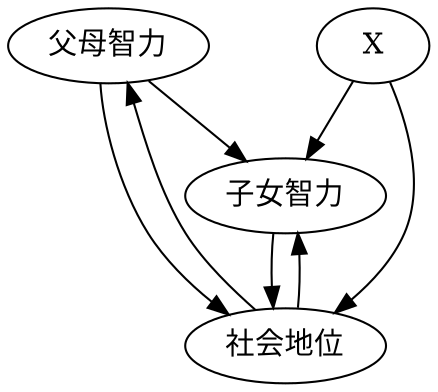
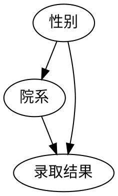
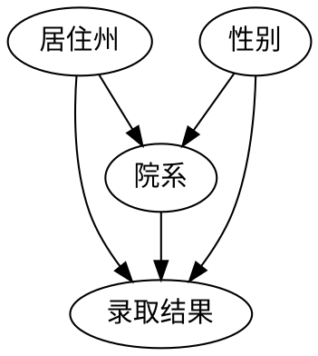

# 中介：寻找隐藏的作用机制

## 1. 中介

两个版本的 “为什么”？

1. 看到果，想知道因：“为什么？他看起来明明很健康，怎么可能心脏病发作？”
2. 为了更好地了解已知因和果之间的联系：“为什么？柑橘类水果预防坏血病的机制是什么？”

第二种情况，科学家使用 “mediation” 来表达。

关于中介，典型的问题是：该种中介是否能解释全部结果。如何区分总效应、直接效应和间接效应是一项难题，该区分不能直接通过干预的实现，而要借助于反事实。

## 2. 坏血病：错误的中介物

时间线：

1. 詹姆斯·林德船长的研究：食用柑橘类水果有助于预防可能致死的坏血病
2. 英国探险队的极地探险：坏血病卷土重来 —— 无知和傲慢
    - 人们发现吃新鲜的肉也能预防败血症
    - 英国的医师忘记了一个世纪以前的教训，斯科特远征队的医师将坏血病归因为污染的肉，带了没有污染的肉，却没有带柑橘类水果
    - 医生们没有真正理解柑橘类水果是如何预防坏血病的，他们不理解关键的中介物是什么：认为酸性物质能够预防，于是替换酸橙并加热烹煮来 “提纯”
3. 1912 年发现了真正的中介物 —— 维生素

## 3. 先天因素与后天培养：巴巴拉·伯克斯的悲剧

伯克斯研究先天因素和后天培养在智力方面所起的作用。设计了以下框架：

伯克斯收集了来自对 204 个有寄养儿童家庭做的家访，排除了父母智力对子女智力的直接遗传影响。发现父母对子女智力的直接效应只占总效应的 35%。

伯克斯发现了对撞效应。而其它一些统计学家将重点放在了控制变量上，忽视了对撞效应的影响，得出了错误的结论。

## 4. 寻找一种语言：伯克利大学招生悖论

案例：加州大学注意到男女学是哪个入学率呈现令人担忧的趋势。其中每个系招生都更偏向女生，而总体更加偏向男生。（女生更加偏向人文院系，男生更加偏向理工院系，后者人多）

因果图如下（简化版）：

根据法院定义，对于歧视问题，真正重要的是直接效应，而非总效应。因此在不考虑中介物和结果混杂的情况下，他们的分析是对的。

克鲁斯尔卡用以下案例指出了问题：缺乏一个明确的、经过检验的结果来确定应该控制的变量。他添加了一个混杂，其版本的因果为：

该情况下，如果只控制院系，则打开了 $性别 \rightarrow 院系 \rightarrow 居住州 \rightarrow 录取结果$ 的后门路径，需要额外控制居住州。

该情况下，控制变量看起来非常不稳定，而且很难以锁定。

以中介物作为条件（对中介物进行变量控制），而不是保持中介物恒定（设其为常量）的情况被称之为中介谬误（mediation fallacy）。如果中介物和结果之间存在混杂，那么这一控制就会完全逆转结果。

确凿性原则：该原则属于总效应，总体的直接效应取决于总体直接效应的总和。因此，当因果推断没有错误的时候，应该不出现这种悖论。

## 5. 黛西、小猫和间接效应

## 6. 线性 “仙境” 中的中介

## 7. 拥抱 “假如” 世界

## 8. 中介个案研究

## 9. 止血带：隐藏的谬误