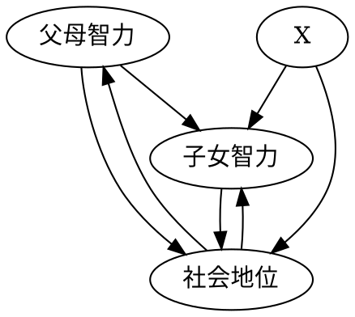
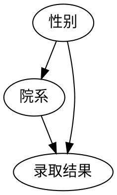
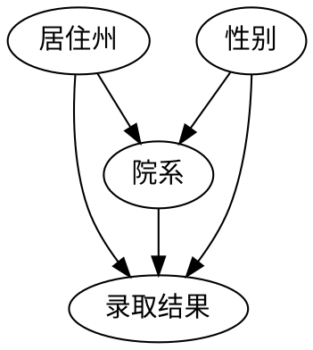

# 中介：寻找隐藏的作用机制

## 1. 中介

两个版本的 “为什么”？

1. 看到果，想知道因：“为什么？他看起来明明很健康，怎么可能心脏病发作？”
2. 为了更好地了解已知因和果之间的联系：“为什么？柑橘类水果预防坏血病的机制是什么？”

第二种情况，科学家使用 “mediation” 来表达。

关于中介，典型的问题是：该种中介是否能解释全部结果。如何区分总效应、直接效应和间接效应是一项难题，该区分不能直接通过干预的实现，而要借助于反事实。

## 2. 坏血病：错误的中介物

时间线：

1. 詹姆斯·林德船长的研究：食用柑橘类水果有助于预防可能致死的坏血病
2. 英国探险队的极地探险：坏血病卷土重来 —— 无知和傲慢
    - 人们发现吃新鲜的肉也能预防败血症
    - 英国的医师忘记了一个世纪以前的教训，斯科特远征队的医师将坏血病归因为污染的肉，带了没有污染的肉，却没有带柑橘类水果
    - 医生们没有真正理解柑橘类水果是如何预防坏血病的，他们不理解关键的中介物是什么：认为酸性物质能够预防，于是替换酸橙并加热烹煮来 “提纯”
3. 1912 年发现了真正的中介物 —— 维生素

## 3. 先天因素与后天培养：巴巴拉·伯克斯的悲剧

伯克斯研究先天因素和后天培养在智力方面所起的作用。设计了以下框架：

伯克斯收集了来自对 204 个有寄养儿童家庭做的家访，排除了父母智力对子女智力的直接遗传影响。发现父母对子女智力的直接效应只占总效应的 35%。

伯克斯发现了对撞效应。而其它一些统计学家将重点放在了控制变量上，忽视了对撞效应的影响，得出了错误的结论。

## 4. 寻找一种语言：伯克利大学招生悖论

案例：加州大学注意到男女学是哪个入学率呈现令人担忧的趋势。其中每个系招生都更偏向女生，而总体更加偏向男生。（女生更加偏向人文院系，男生更加偏向理工院系，后者人多）

因果图如下（简化版）：

根据法院定义，对于歧视问题，真正重要的是直接效应，而非总效应。因此在不考虑中介物和结果混杂的情况下，他们的分析是对的。

克鲁斯尔卡用以下案例指出了问题：缺乏一个明确的、经过检验的结果来确定应该控制的变量。他添加了一个混杂，其版本的因果为：

该情况下，如果只控制院系，则打开了 $性别 \rightarrow 院系 \rightarrow 居住州 \rightarrow 录取结果$ 的后门路径，需要额外控制居住州。

该情况下，控制变量看起来非常不稳定，而且很难以锁定。

以中介物作为条件（对中介物进行变量控制），而不是保持中介物恒定（设其为常量）的情况被称之为中介谬误（mediation fallacy）。如果中介物和结果之间存在混杂，那么这一控制就会完全逆转结果。

确凿性原则：该原则属于总效应，总体的直接效应取决于总体直接效应的总和。因此，当因果推断没有错误的时候，应该不出现这种悖论。

## 5. 黛西、小猫和间接效应

当控制中介因子M，并干预暴露因子X时，结果因子的变动被称为X对Y的受控直接效应（controlled direct effect），有：

$$
CDE(0) = P(Y=1|do(X=1), do(M=0)) - P(Y=1|do(X=0),do(M=0))
\tag{1}
$$

注意到，假设 $M$ 为二值变量，则存在控制 $M$ 为 0 和 1 的两种边缘概率。同时，注意到，很多情况下条件不允许控制中介变量，因为它不人道和不可能。此外，不存在受控间接效应。

幸运的是，存在一种 “自然直接效应”（natural direct effect），该效应表示 “本来就” 的概率。该种效应的判断中需要反事实。可定义为：

$$
NDE = P(Y_{M=M_0}=1|do(X=1)) - P(Y_{M=M_1}=1|do(X=0))
\tag{2}
$$

该式通过使用其报告的性别而非原始的性别来决定其的被选择。由于包含反事实信息，因此该式不能使用 do 表达式来定义。

达娜在带回小猫的时候，会更加严格地管控黛西，黛西会更加听话。在判断中，使用了反事实估计在不在家的时候可能的结果。

NDE 效应对应的间接版本被称为自然间接效应（Natural indirect effect，NIE）。可定义为：

$$
NIE = P(Y_{M=M_1}=1|do(X=0)) - P(Y_{M=M_0}=1|do(X=0))
\tag{3}
$$

反事实的计算必须基于特定案例的特定动物，因此不同的动物可能有非常不同的特性。但是当 $M$ 和 $Y$ 之间如果没有混杂时，实际上该值是可计算的。

## 6. 线性 “仙境” 中的中介

在系统的效应都是线性的时候，存在 $总效应 = 直接效应 + 间接效应$ 的情况。但当不是线性的时候，这个假设很可能失效，因此需要在运用假设时需要判断交互效应。

实际上，存在一个普适的关系：

$$
TE(X=0->X=1) = NDE(X=0->X=1) - NIE(X=1->X=0)
\tag{4}
$$

## 7. 拥抱 “假如” 世界

对于更加一般的情况，NIE 可以定义为：

$$
NIE = \sum_{m}[P(M=m|X=1)-P(M=m|X=0)]*P(Y=1|X=0, M=m)
\tag{5}
$$

## 8. 中介个案研究

### 8.1 全民学代数

全民学代数政策导致的课堂形式的变化抵消了代数学习对分数带来的正面影响。

### 8.2 吸烟基因：中介和干预

确实发现了吸烟基因，但是引发肺癌的关键因素仍然是吸烟。一个拥有吸烟基因的人，如果不吸烟，其患有肺癌的概率也会大大降低。即吸烟是吸烟基因和肺癌的中介物。

研究发现：

- 如果不吸烟，吸烟基因不会产生影响
- 如果少量吸烟，吸烟基因就已经能够产生很严重的影响

### 8.3 止血带：隐藏的谬误

由于不规范的使用和糟糕的环境，早期在战场上的止血带会由于其间接效应抵消部分直接效应带来的好处。当正确使用后，效果大幅度提升。

止血带提前使用的士兵入院后存活率并不比不使用的士兵高，一个可能的原因是他们的受伤程度是入院前存活和入院后存活的混杂因子。