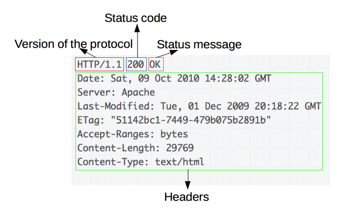

1.  HTTP 概述

    1.  基于 HTTP 的组件系统：

        1.  客户端：user-agent 是任何能为用户发起行为的工具，通常由浏览器扮演

        2.  Web 服务端：服务并提供客户端请求的文档，它只是虚拟意义上代表的机器

        3.  代理：转发 HTTP 消息

            1.  缓存

            2.  过滤

            3.  负载均衡

            4.  认证

            5.  日志记录

    <!-- -->

    1.  HTTP 的基本性质：

        1.  是简单的：HTTP 报文允许被人读懂，且允许简单测试，降低门槛（2.0封装在帧中）

        2.  可拓展的：HTTP/1.0 开始出现的 headers 让协议拓展变得非常容易

        3.  无状态有会话

        4.  HTTP 和连接：

            1.  连接是由传输层控制的，可靠性依赖传输层协议

            2.  HTTP1.0 为一个请求响应打开一个 TCP 连接，因此耗时；HTTP1.1 引入了流水线和持久连接，可以通过 Connection 头部（keep-alive/close）来部分控制；HTTP2 可以通过为一个连接复用消息的方式让连接保持暖连接;HTTP3 可以以 UDP 为基础使用 QUIC

    <!-- -->

    1.  HTTP 能控制什么

        1.  缓存：告诉代理和客户端哪些文档需要被缓存，缓存多久，客户端也可以命令中间的缓存代理忽略存储的文档

        2.  开放同源限制

        3.  认证：使用 Authenticate 头部等

        4.  代理和隧道

        5.  会话

    <!-- -->

    1.  HTTP 报文

        1.  请求：

            1.  

        <!-- -->

        1.  响应：

            1.  

<!-- -->

1.  HTTP 缓存

    1.  缓存种类：

        1.  （私有）浏览器缓存

        2.  （共享）代理缓存

    <!-- -->

    1.  缓存操作的目标：

        1.  一般只能缓存 GET 响应

            1.  检索请求的成功响应 200

            2.  永久重定向：301

            3.  错误响应：404

            4.  不完全的响应：202

        <!-- -->

        1.  如果匹配到作为一个已被定义的 cache 键名的响应

    <!-- -->

    1.  缓存控制：

        1.  Cache-Control 头

            1.  禁止进行缓存: Cache-Control: no-store

            2.  强制确认缓存：Cache-Control: no-cache

            3.  私有缓存和公有缓存：Cache-Control: private/public

            4.  缓存过期机制：Cache-Control: max-age=31535000（表示资源能够保持新鲜的最大时间）

            5.  缓存验证确认: Cache-Control: must-revalidate 使用过期的资源时，先验证状态

        <!-- -->

        1.  Pragma 头：用以向后兼容 HTTP1.0 的缓存控制，相当于 no-store

    <!-- -->

    1.  新鲜度

        1.  不新鲜处理：新鲜度超过，一般不会直接清除或者忽略资源，当服务器发起请求时，缓存检索到一个对应的陈旧资源，会附加一个 If-None-Match 头，若服务器返回 304，则新鲜；如果 If-None-Match 和 If-Modified-Since 判断过期，则返回带有该资源的实体

        2.  判断新鲜度：如果 max-age=N，则缓存寿命为 N，否则 expires 的值和 Date 属性的值判断缓存是否有效，如果都没有，查找 Last-Modified, 如果有， 则寿命 = (Date - Last-Modified)/10;

            1.  expirationTime = responseTime + freshnessLifetime - currentAge

        <!-- -->

        1.  加速资源：大多数资源使用较长的缓存周期保存较长的时间，但是对于热点资源难以处理，于是可以使用 revving 的技术，在文件名后面加上版本号。

    <!-- -->

    1.  缓存验证：

        1.  如果头中含有 Cache-Control: must-revalidate 则缓存文档过期后，需要进行缓存验证或者重新获取资源。只有在服务器返回强校验器或者弱校验器时才会验证。

        2.  ETag： 响应头是对用户代理不透明的值。如果带有 Etag 可以使用 If-None-Match 来验证

        3.  Last-Modified： 可以视为弱验证器，可以带上 If-Modified-Since 来验证缓存

    <!-- -->

    1.  带 Vary 头的响应

        1.  该头决定了对于后续响应头，如何判断是请求一个新的资源还是使用缓存的资源，当缓存服务器收到请求，只有当前请求和原始请求头中的 Vary 匹配，才使用缓存的响应

        2.  使用该头有利于内容服务的多样性：如使用 Vary: Content-Encoding/User-Agent

<!-- -->

1.  HTTP Cookies

    1.  HTTP Cookie 也叫 Web Cookie，是服务器发送到用户浏览器并保存在本地的一小块数据。

    2.  作用：

        1.  会话状态管理

        2.  个性化设置

        3.  浏览器行为跟踪

    <!-- -->

    1.  创建 Cookie：

        1.  Set-Cookie: &lt;key&gt;=&lt;value&gt;

        2.  可以设置多个

        3.  浏览器每次都会将之前发送的 Cookie 信息通过 Cookie 请求返回给服务器

    <!-- -->

    1.  会话期 Cookie：会话期 Cookie 是最简单的 Cookie，浏览器关闭后自动删除

    2.  持久性 Cookie：需要设置过期时间和有效期，在 Cookie 中，如：Set-Cookie: id=a3fWa; Expires=Wed, 21 Oct 2015 07:28:00 GMT;

    3.  Cookie 的 Secure 和 HttpOnly 标记

        1.  Secure 标记只能通过 HTTPS 协议传送；但由于固有的不安全性，即使设置了该标记，也不应该通过 Cookie 传送敏感内容

        2.  为避免 跨域脚本 XSS 攻击，通过 Document.cookie API 无法访问带有 HTTPOnly 标记的脚本

    <!-- -->

    1.  Cookie 作用域：

        1.  Domain 和 Path 标识了 Cookie 的作用域

        2.  如果 Domain 不指定，默认为当前文档的确切主机；如果指定 Domain，则默认包含子域名

        3.  Path 会匹配子域名

    <!-- -->

    1.  SameSite Cookies

        1.  SameSite Cookies 允许服务器要求某个 cookie 在跨站请求时不会被发送，从而阻止跨站请求攻击

        2.  None：不使用

        3.  Strict：只发送 URL 完全一致

        4.  Lax： 默认选项，Same-site cookies 将会为一些跨站子请求保留，如图片加载或者 iframes 的调用，只有当用户从外部站点导航到 URL 时才会发送

    <!-- -->

    1.  安全性

        1.  会话劫持和 XSS（Cross-site Script）：HTTPOnly

        2.  跨站请求伪造（CSRF, Cross-site Request Forgery)：

            1.  对用户输入进行过滤来阻止 XSS

            2.  任何敏感操作都需要确认

            3.  用于敏感信息的 Cookie 只能有较短的生命周期

    <!-- -->

    1.  追踪和隐私

        1.  第三方 Cookie：每个 Cookie 都会有与之关联的域，如果相同则称为第一方 Cookie，否则为第三方 Cookie

        2.  禁止追踪 Do-Not-Track：DNT 可以告诉 Web 程序不要对用户行为进行追踪或者跨站追踪

        3.  欧盟 Cookie 指令：在征得用户的同意之前，网站不允许通过计算机、手机或其他设备存储、检索任何信息。自那以后，很多网站都在网站声明中添加了相关说明，告诉用户它们的 Cookie 将用于何处。

        4.  僵尸 Cookie 和删不掉的 Cookie：该类 Cookie 一般使用 Web Storage API、Flash 本地共享对象或者其他技术手段来达到

<!-- -->

1.  HTTP 访问控制

    1.  什么情况下需要 CORS：跨域资源共享标准允许在下列场景中使用跨域 HTTP 请求：

        1.  由 XMLHttpRequest 或 Fetch 发起的跨域 HTTP 请求

        2.  Web 字体

        3.  WebGL 贴图

        4.  使用 drawImage 将 Images/video 绘制到 canvas

    <!-- -->

    1.  功能概述：

        1.  新增了一组 HTTP 首部字段，允许服务器声明哪些源站通过浏览器有权限访问哪些资源。

        2.  那些可能对服务器数据产生副作用的 HTTP 请求方法；浏览器必须首先使用 OPTIONS 方法发起一个预检请求（preflight request），从而获知服务端是否允许该跨域请求。服务器确认允许之后，才发起实际的 HTTP 请求。

        3.  在预检请求的返回中，服务器端也可以通知客户端，是否需要携带身份凭证。

        4.  CORS 请求失败产生错误，但是为了安全，只能通过查看浏览器控制台以得知具体哪里出现错误。

    <!-- -->

    1.  若干访问控制场景

        1.  简单请求：

            1.  条件：

                1.  使用下列方法之一的请求可视为简单请求：GET、HEAD、POST

                2.  Fetch 规范定义对 CORS 安全的首部字段集合，不得人为设置该集合之外的其它首部字段，集合为：

                    1.  Accept

                    2.  Accept-Language

                    3.  Content-Language

                    4.  Content-Type（仅限于 text/plain，multipart/form-data, application/x-www-form-urlencoded）

                    5.  DPR

                    6.  Downlink

                    7.  Save-Data

                    8.  Viewport-Width

                    9.  Width

                <!-- -->

                1.  说明：

                    1.  请求中的任何 XMLHttpRequestUpload 对象均没有注册任何事件监听器；该对象可以使用 upload 属性访问

                    2.  请求中没有使用 ReadableStream

            <!-- -->

            1.  基本使用：请求带有 Origin 字段，服务器带有 Access-Control-Allow-Origin 字段，一般为 '\*' 或者为 'protocol: // host'

        <!-- -->

        1.  预检请求：

            1.  条件：

                1.  使用了下面任意 HTTP 方法：PUT、DELETE、CONNECT、OPTIONS、TRACE、PATCH

                2.  人为设置了对 CORS 安全的首部集合之外的其它首部字段：

                    1.  Accept

                    2.  Accept-Language

                    3.  Content-Language

                    4.  Content-Type

                    5.  DPR

                    6.  Downlink

                    7.  Save-Data

                    8.  Viewport-Width（不属于 text/plain，multipart/form-data, application/x-www-form-urlencoded）

                    9.  Width

                <!-- -->

                1.  注意：

                    1.  请求中的 XMLHttpRequestUpload 对象注册了多个事件监听器

                    2.  请求中使用了 ReadableStream 对象

                <!-- -->

                1.  使用：

                    1.  

                    2.  预检请求中携带了 Access-Control-Request-Method: POST、Access-Control-Request-Headers。

                        1.  前者告知服务器，请求将使用的 POST 方法；

                        2.  后者告知服务器将携带的自定义请求首部字段。服务器据此决定，该请求是否被允许

                    <!-- -->

                    1.  预检响应携带了 Access-Control-Allow-Origin，Access-Control-Allow-Methods，Access-Control-Allow-Headers，Access-Control-Max-Age

                        1.  Access-Control-Allow-Origin 告知允许的域

                        2.  Access-Control-Allow-Methods 告知允许的方法

                        3.  Access-Control-Allow-Headers 告知允许的头部

                        4.  Access-Control-Max-Age 说明一段时间内无需再次发起预检请求（若此值大于浏览器维护的值，则无效）

    <!-- -->

    1.  预检请求与重定向

        1.  大多数浏览器不支持针对预检请求的重定向，后续修订中废除了这一要求

        2.  在浏览器实现跟上规范之前，有两种方法规避上述报错：

            1.  在服务端去掉对预检请求的重定向

            2.  将实际请求变成一个简单请求

        <!-- -->

        1.  若无法实现（在存在 Authorization 字段或者引发预检请求时，该方法无效）：

            1.  发出一个简单请求，判断预检请求返回哪个地址

            2.  发出另一个请求，使用 Response.url 或者 XMLHttpRequest.responseURL 获得的 URL

    <!-- -->

    1.  附带身份凭证的请求：

        1.  将 XMLHttpRequest 的 withCredentials 标志位 true，则会向服务器发送身份凭证信息，如果服务端响应中未携带 Access-Control-Allow-Credentials: true 则浏览器不会将响应内容发给请求的发送者

        2.  附带身份凭证的请求：不得使用通配符匹配域名

        3.  响应中若附带 Set-Cookie 字段，尝试对 Cookie 进行修改，如果操作失败，则会抛出异常

    <!-- -->

    1.  HTTP 响应首部字段：

        1.  Access-Control-Allow-Origin: &lt;origin&gt;\[,&lt;Origin&gt;…\] | \*

        2.  Access-Control-Expose-Headers: &lt;可以暴露的响应头&gt;\[,&lt;other&gt;…\] —— 在跨域访问时，XMLHttpRequest 对象的 getResponseHeader() 方法只能拿到最基本的响应头，如果需要访问其他头，则需要服务器设置本响应头

        3.  Access-Control-Max-Age: &lt;delta-seconds&gt; —— 能够缓存多久

        4.  Access-Control-Allow-Credentials: true —— 指定当浏览器设置 credentials 为 true 时，能够读取响应

        5.  Access-Control-Allow-Methods： &lt;method&gt;\[,&lt;method&gt;\]\* —— 实际请求允许使用的 HTTP 方法

        6.  Access-Control-Allow-Headers: &lt;field-name&gt;\[, &lt;field-name&gt;\]\* —— 实际请求中允许携带的首部字段

    <!-- -->

    1.  HTTP 请求首部字段：

        1.  Origin: &lt;origin&gt; —— 不包含路径的源站 URL

        2.  Access-Control-Request-Method: &lt;method&gt; —— 实际请求所使用的方法

        3.  Access-Control-Request-Method: &lt;field-name&gt;\[, &lt;field-name&gt;\]\* —— 将实际请求所携带的字段告诉服务器

<!-- -->

1.  HTTP 的发展

    1.  HTTP/1.0 - 特性：

        1.  协议信息随着每个请求发送

        2.  状态码在响应开始时发送

        3.  引入 HTTP 头

        4.  可以使用 Content-Type 头来传输除 HTML 文件外其他类型文档的能力

    <!-- -->

    1.  HTTP/1.1

        1.  特性：

            1.  连接可以复用

            2.  增加流水线

            3.  支持响应分块

            4.  引入缓存控制

            5.  引入内容协商

            6.  使用 Host 头，使得不同域名可以配置在同一个 IP 地址的服务上

        <!-- -->

        1.  拓展：

            1.  用于安全传输：SSL 和 TLS

            2.  用于复杂应用：

                1.  REST

                2.  Server-sent events

                3.  WebSocket

            <!-- -->

            1.  放松 Web 的安全模型：CORS、DNT、CSP

    <!-- -->

    1.  HTTP/2 - SDPY

        1.  特性：

            1.  HTTP/2 是二进制协议。不可再读，也不可无障碍的手动创建

            2.  并行的请求能够在一个链接中处理，移除了 1.x 中的顺序和阻塞（但是仍然存在队首阻塞）

            3.  压缩了 headers，一系列的请求中部分 headers 可以压缩

            4.  允许服务器在客户端缓存中填充数据，通过有限的服务器推送机制来提前请求

        <!-- -->

        1.  拓展：

            1.  对 Alt-Src 的支持允许了给定资源的位置和资源鉴定，允许更加智能的 CDN 缓存机制

            2.  Client-Hints 的引入允许客户端和服务器主动交流它的需求和硬件约束的信息

            3.  在 Cookie 头中引入安全相关的前缀，可以帮助一个安全的 Cookie 没有被修改过

<!-- -->

1.  内容安全策略

    1.  配置网络服务器返回 Content-Security-Policy HTTP 头部，&lt;meta&gt; 元素也可以被用来配置策略，例如：

        1.  &lt;meta http-equiv="Content-Security-Policy" content="default-src 'self'; img-src [https://\*](https://*); child-src 'none';"&gt;

    <!-- -->

    1.  威胁：

        1.  跨站脚本攻击：

        2.  数据包嗅探攻击：使用 Strict-Transport-Security 确保连接的浏览器只能使用加密通道

    <!-- -->

    1.  使用 CSP

        1.  指定策略：Content-Security-Policy: policy

        2.  描述策略：一个策略由一系列策略指令所组成，每个策略指令都描述了一个针对某个特定类型资源以及生效范围的策略

        3.  示例：

            1.  Content-Security-Policy: default-src 'self'; img-src \*; media-src media1.com media2.com; script-src userscripts.example.com

    <!-- -->

    1.  对策略测试：

        1.  Content-Security-Policy-Report-Only: policy 开启报告模式，对每个企图违反所建立的策略都发送违规报告，需要包含有效的 report-uri 指令
