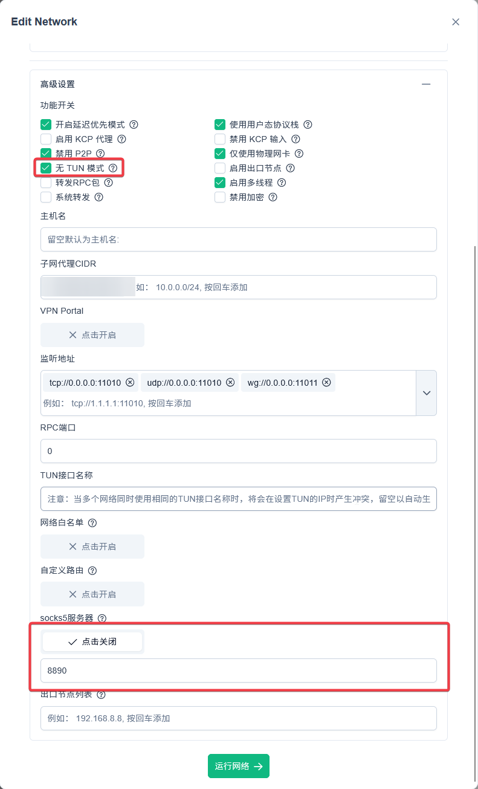
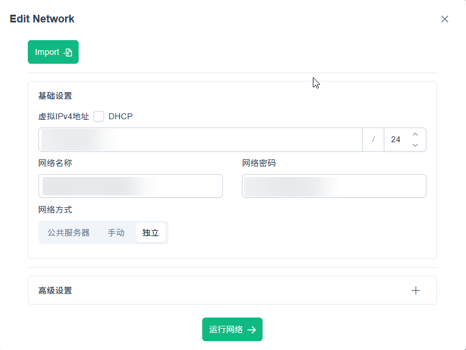

# EASYTIER 特殊组网要点若干

## 1. 在开启其它四层代理的路由设备上，支持 EASYTIER

- **需求背景**：家庭网络经常在主路由设置四层代理（如 openclash），通常不能和 EASYTIER 的默认 tun 配置冲突，导致同时访问 easytier 网络和其他代理网络出现问题

- **总体思路**：保持原来的四层代理，并将 EASYTIER 设置为对应四层代理的上级代理，配置分流规则

- 配置路由设备 easytier 的网络配置，关闭 tun，开启 socks5 代理（指定一个不冲突的端口号，如 8890），示例如下



- 配置路由设备的主要四层代理：在上游代理配置中，添加 easytier 的 socks5 端口号
    - `openclash` 示例：添加如下到 proxies 列表中

```configuration.yaml
proxies:
  - name: "EASYTIER-ROUTER"
    type: socks5
    server: 192.168.5.1
    port: 8890
```

- 配置路由设备的主要四层代理：在分流规则中添加 easytier 的网段 CIDR 以及 easytier 网络中所有其它节点的子网代理 CIDR，注意不要添加本地局域网的 CIDR
    - `openclash` 示例：添加如下到 `rules` 列表中，具体视你的 easytier 网段配置而定

```configuration.yaml
rules:
  - IP-CIDR,192.168.6.0/24,EASYTIER-ROUTER
  - IP-CIDR,192.168.128.0/24,EASYTIER-ROUTER
```

- 配置路由设备的主要四层代理：如果有绕过规则，将 easytier 的网段 CIDR 以及 easytier 网络中所有其它节点的子网代理 CIDR 从绕过的列表中移除
    - `openclash` 示例：删除 `插件设置 - 流量控制 - 本地 IPv4 绕过地址` 中的覆盖你的 easytier 网段的配置，细化成仅绕开局域网的网段

```txt
# 192.168.0.0/16 # 删除覆盖 easytier 网段和其他子网的 IP-CIDR
192.168.1.0/24 # 添加局域网 IP-CIDR
```

- 配置完成，该路由覆盖环境中，easytier 的网段和原来代理的网段可以同时无缝访问

## 2. 降低海外服务器和非海外服务器的 EASYTIER 丢包

- **需求背景**：有时需要定期同步海外服务器和非海外服务器之间传递配置等消息，但 easytier 虚拟网络由于各种原因丢包率很高，而在非海外服务器上设置其他通道又容易被云服务商 gank

- **总体思路**：将中转 easytier 节点放在可信透明海外四层代理网络的非网关节点上，关闭 P2P

- 将海外服务器的 easytier `网络方式` 设为独立服务器或者仅指向海外服务器上游，关闭 P2P；非海外服务器的 easytier `网络方式` 也设为独立服务器或者仅指向非海外服务器上游，关闭 P2P
    - 假设海外服务器的 IP 为 a.a.a.a，非海外服务器的 IP 为 b.b.b.b



- 在任何可信的有海外透明四层代理网络环境，找到一个非网关设备开启 easytier，上游同时设置为海外服务器和非海外服务器：
    
    - （普通方法，推荐）如果是家庭网络，则可以仅在如 NAS 等非路由设备，将 easytier 的 `网络方式` 设置为手动，上游指向海外服务器（a.a.a.a） 和非海外服务器（b.b.b.b）

    - （高阶方法，不推荐） 如果你的网络技术水平较高，也可以在路由设备上的 easytier docker 镜像中，关闭 docker 的 `network_mode: host` 并设置 docker 的环境代理，该方法需要设置避免环路，且设置错误容易断网

- 配置完成，海外和非海外服务器之间将显示为 relay(2) 及以上，丢包率较低


