1.  HTML 基础格式

    1.  HTML 文档格式：

        1.  &lt;!DOCTYPE html&gt; 是最短的有效的文档声明

        2.  &lt;html&gt; &lt;/html&gt; 包裹整个页面，为根元素

        3.  &lt;head&gt;&lt;/head&gt; 元素，包含想在 html 中包含但是不想在页面中显示的内容

        4.  &lt;body&gt;&lt;/body&gt; 包含访问页面时能显示在页面上的内容

        5.  &lt;meta charset="utf-8"&gt; 设置文档使用 utf-8 字符集编码

        6.  &lt;title&gt;&lt;/title&gt; 设置页面标题

    <!-- -->

    1.  常见转义：&lt; 小于 、&gt; 大于、&quot 双引号、&apos 单引号、&amp; and 符

    2.  HTML 注释：&lt;!--content--&gt;

    3.  HTML 元数据

        1.  添加作者和描述：

            1.  格式 &lt;meta name="name-value" content="content-vlaue"&gt;

            2.  name 例如 author、description、keywords 等

        <!-- -->

        1.  其它类型的元数据：

            1.  facebook 的 Open Graph Data 为网站提供了更丰富的元数据，格式为 og: name

            2.  twitter 也有自己的专属元数据

        <!-- -->

        1.  在站点增加自定义图标：

            1.  &lt;link rel="shortcut icon" size="144x144" href="favicon.ico" type="image/x-icon"&gt;

        <!-- -->

        1.  在 HTML 中应用 CSS 和 Javascript

            1.  样式，放在头部，&lt;link rel="stylesheet" href="my-css-file.css"&gt;

            2.  脚本可以放在头部和尾部（放在尾部可以减少报错阻塞加载不存在的元素）&lt;script src="my-js-file.js"&gt;&lt;/script&gt;

        <!-- -->

        1.  为文档设定主语言：

            1.  在 html tag 的属性上设置 lang ，如 &lt;html lang="en-US"&gt; &lt;span lang="jp"&gt;

    <!-- -->

    1.  HTML 文字处理基础：

        1.  标题和段落

            1.  常见标签 &lt;p&gt;、&lt;h\[1-6\]&gt;、&lt;span&gt;（它没有语义）

        <!-- -->

        1.  列表：

            1.  &lt;ul&gt; 无序

            2.  &lt;ol&gt; 有序

            3.  &lt;li&gt; 列表项

            4.  &lt;li&gt;content&lt;ul&gt;&lt;li&gt;content-inner 嵌套列表

        <!-- -->

        1.  重点强调

            1.  &lt;em&gt; 强调某个单词，斜体

            2.  &lt;strong&gt; 非常强调，需要重音，粗体

            3.  &lt;i&gt; 传统的斜体：外国文字、分类名称、技术术语、一种思想。非语义建议使用 font-style: italic

            4.  &lt;b&gt; 传统的粗体：关键字、产品名称、引导句。非语义建议使用 font-weight: bold

            5.  &lt;u&gt; 传统的下划线：专有名词，拼写错误。非语义建议使用 font-decoration: underline

    <!-- -->

    1.  超链接

        1.  基本形式：&lt;a href="url"&gt;content&lt;/a&gt;

        2.  使用 title 属性添加支持信息：title="xxx"，用于包含关于链接的补充有用信息，比如包含怎样的信息或者注意的事情，当鼠标指针悬停在链接上时，标题将作为提示信息出现

        3.  统一资源定位符（Uniform Resource Locator, URL）与路径：略

        4.  链接最佳实践：

            1.  用清晰的链接措辞

                1.  缘由：

                    1.  使用屏幕阅读器的用户喜欢从页面上的一个链接跳转到另一个链接，并且脱离上下文来阅读链接

                    2.  搜索引擎使用链接文本来索引目标文件，在链接文本中包含关键词和有关信息的描述是很好的主意

                    3.  读者往往会浏览页面而不是阅读每一个字，他们的眼睛会被页面的特征所吸引，比如链接。他们会找到描述性的链接

                <!-- -->

                1.  提示：

                    1.  不要重复 URL 作为链接文本的一部分

                    2.  不要在链接中说链接或者链接到

                    3.  保持链接标签尽可能短

            <!-- -->

            1.  尽可能使用相对链接

                1.  检查代码容易的多

                2.  在可能的情况下使用相对 URL 更有效（使用 URL 时浏览器使用 DNS 查找服务器的真实位置）

            <!-- -->

            1.  链接到非 HTML 资源 —— 留下清晰的指示

                1.  可能：

                    1.  低连接宽带，下载阻塞

                    2.  流量计费宽带，经济损失

                    3.  不支持的格式，浪费时间

            <!-- -->

            1.  下载链接时使用 download 属性

                1.  当链接到要下载的资源而不是在浏览器中打开的时候，可以使用 download 属性来提供一个默认的保存文件名

                2.  词属性仅适用同源 URL

            <!-- -->

            1.  电子邮件链接

                1.  使用 [mailto:email](mailto:email) 的形式

                2.  打开邮件客户端并选择用户

                3.  当不填写email时，仅仅是打开邮件客户端

    <!-- -->

    1.  高级文字排版

        1.  描述列表

            1.  元素：

                1.  &lt;dl&gt; 描述列表，&lt;dt&gt; 描述项（description term），&lt;dd&gt; 描述描述（description description）

        <!-- -->

        1.  引用：

            1.  块引用

                1.  &lt;blockquote&gt;

                2.  可以在 cite 属性中指明需要引用的资源

            <!-- -->

            1.  行内引用

                1.  &lt;q&gt; 旨在用于不需要分段的短引用

                2.  同样可以使用 cite 属性

            <!-- -->

            1.  引文

                1.  cite 属性不会被显示和屏幕阅读器阅读

                2.  &lt;cite&gt; 元素可以，其默认样式为斜体

                3.  &lt;a href="url"&gt;&lt;cite&gt;&lt;/cite&gt;&lt;/a&gt; 请这样使用

        <!-- -->

        1.  缩略语：

            1.  &lt;abbr title=""&gt; content &lt;/abbr&gt;

            2.  用来包裹一个缩略语或者缩写，title 指示全称

        <!-- -->

        1.  联系方式

            1.  &lt;address&gt;xxx&lt;address&gt;

            2.  可以在内部嵌入 &lt;p&gt; &lt;a&gt; 等标签

        <!-- -->

        1.  上标和下标

            1.  &lt;sub&gt; 表示上标

            2.  &lt;sup&gt; 表示下标

        <!-- -->

        1.  展示计算机代码：

            1.  &lt;code&gt; 用于标记通用计算机代码

            2.  &lt;pre&gt; 用于保留空白字符，特别是将原有代码格式展现出来

            3.  &lt;var&gt; 用于标记具体变量名

            4.  &lt;kbd&gt; 用于标记电脑键盘的输入

            5.  &lt;samp&gt; 用于标记计算机程序的输出

        <!-- -->

        1.  标记日期和时间

            1.  &lt;time datetime="2016-01-20"&gt;2016年1月20日&lt;/time&gt;

            2.  该元素允许附上清晰的、可被机器识别的日期格式

    <!-- -->

    1.  文档与网站架构

        1.  文档的基本组成部分

            1.  页眉：通常横跨于整个页面顶部有一个大标题或者标志。包含网站的主要一般信息，通常存在于所有网页

            2.  导航栏：指向网站各个主要区段的超链接。通常用菜单按钮、链接或者标签页表示。类似于标题栏，导航栏通常应在所有网页之间保持一致。

            3.  主内容：中心大部分区域是当前网页大多数的独有内容。

            4.  侧边栏：一些外围信息、链接、引用、广告等。通常与主内容相关，还可能存在其他的重复元素，如辅助导航系统

            5.  页脚：横跨页面底部的狭长区域。和标题一样，用于放置公共信息，使用较小字体，通常为次要内容。还可以提供快速访问链接来进行 SEO

        <!-- -->

        1.  用于构建内容的 HTML

            1.  &lt;header&gt; 页眉

            2.  &lt;nav&gt; 导航栏

            3.  &lt;main&gt; 主内容

                1.  &lt;article&gt; 文章

                2.  &lt;section&gt; 包含在 html 文档中的一个独立部分，通常会有标题

                3.  &lt;div&gt; 通用块布局元素

            <!-- -->

            1.  &lt;aside&gt; 侧边栏，经常嵌套在 &lt;main&gt; 中

            2.  &lt;footer&gt; 页脚

        <!-- -->

        1.  HTML 布局元素细节

            1.  实践指导：

                1.  &lt;main&gt; 存放页面中独有的元素，且直接位于 body 中（原生网页）

                2.  &lt;article&gt; 包围的内容是一篇文章，与页面其它部分无关

                3.  &lt;section&gt; 适用于按其功能组织页面

                4.  &lt;aside&gt; 包含一些间接信息

                5.  &lt;header&gt; 是简介形式的内容，如果是 &lt;body&gt; 的子元素就是网站的全局页眉，如果是 &lt;header&gt; &lt;section&gt; 的子元素，那么就是这些部分特有的页眉

                6.  &lt;nav&gt; 包含页面的主导航内容

                7.  &lt;footer&gt; 包含页面的页脚部分

            <!-- -->

            1.  无语义元素：

                1.  &lt;span&gt; 为内联的无语义元素，最好只用于无法找到更好的语义元素来包含内容时，或者不想增加特定的含义时

                2.  &lt;div&gt; 为块级无语义元素，应仅用于找不到更好的块级元素时，或者不想增加特定的意义时

            <!-- -->

            1.  换行和水平分割线

                1.  &lt;br&gt; 用于在段落中进行换行，是唯一能生成多个短行结构的元素（除非修改CSS）

                2.  &lt;hr&gt; 元素在文档中生成一条水平分割线，表示文本中主题的变化

<!-- -->

1.  多媒体与嵌入

    1.  HTML 中的图片

        1.  基础的图片使用

            1.  &lt;img src="path"&gt;

        <!-- -->

        1.  使用规范：hotlinking 盗链

            1.  你是图片版权的所有者

            2.  你有图片版权所有者明确的、书面上的使用授权

            3.  你有充分的证据证明这张图片是公共领域内的

        <!-- -->

        1.  备选文本 alt 其值为对图片的文字描述，用于图片无法显示或不能看到的情况下

            1.  用处：屏幕阅读器；图片路径或者文件名拼错的备案；浏览器不支持该类型图片；提供给搜索引擎使用；在移动数据等条件下关闭图片以减少数据传输

            2.  原则：

                1.  装饰：对于仅用于装饰的图片，写空 alt，避免屏幕阅读器浪费时间；或者建议使用 background

                2.  内容：如果在主要文本中已经描述了提示，则空 alt，不要重复

                3.  链接：如果把图片嵌在 &lt;a&gt; 中，需要提供无障碍的链接文本

                4.  文本：不应该将文本放在图片内

        <!-- -->

        1.  宽度和高度：

            1.  图片是可替换元素，布局时会预先计算好大小

            2.  不建议使用 HTML 属性改变图片大小，会造成模糊或者浪费带宽，请预先处理

            3.  设定长宽会强制缩放图片

            4.  实在需要，请使用 CSS 的 object-fit 和 object-position 来调整图像

        <!-- -->

        1.  图片标题

            1.  为图片增加 title 属性来提供需要更进一步的支持信息（在鼠标悬停时，会显示）

        <!-- -->

        1.  图片解说：

            1.  &lt;figure&gt; &lt;img&gt; &lt;figcaption&gt; 告诉浏览器和其它辅助技术说明文字描述了 figure 元素的内容

    <!-- -->

    1.  视频和音频内容：

        1.  video 标签

            1.  基本属性：

                1.  src 指向要嵌入网页中的视频义原

                2.  controls 能够控制视频和音频的回放功能，默认提供浏览器提供的控制接口，也可以调用 JavaScript API 编写自己需要的接口（见 HTMLMediaElement），至少要包含开始和停止，以及调整音量的功能

                3.  video 标签内的段落，当浏览器不支持 video 标签的时候，将会显示，使得能够对浏览器提供一些兼容处理

            <!-- -->

            1.  多格式支持：

                1.  格式支持：

                    1.  WebM 容器包括 Ogg Vorbis 音频和 VP8/VP9 视频

                    2.  MP4 格式通常包括 AAC 以及 MP3 音频和 H.264 视频

                    3.  其它，见 [https://developer.mozilla.org/zh-CN/docs/Web/HTML/Supported\_media\_formats\#%E6%B5%8F%E8%A7%88%E5%99%A8%E5%85%BC%E5%AE%B9%E6%83%85%E5%86%B5](https://developer.mozilla.org/zh-CN/docs/Web/HTML/Supported_media_formats#%E6%B5%8F%E8%A7%88%E5%99%A8%E5%85%BC%E5%AE%B9%E6%83%85%E5%86%B5)

                <!-- -->

                1.  支持方案：

                    1.  &lt;video controls&gt; &lt;source src="xxx.mp4" type="video/mp4"&gt; &lt;source src="xxx.webm" type="video/webm"&gt; &lt;p&gt; 提示 &lt;a&gt; 链接…

            <!-- -->

            1.  其它 video 特性

                1.  width 和 height 属性，可以手动限制长宽

                2.  autoplay 属性，会使得视频和音频自动播放

                3.  loop 属性，会让音频和视频文件循环播放

                4.  muted 会导致媒体播放时，默认关闭声音

                5.  poster 指向一个图像的 URL，会在视频播放前显示

                6.  preload 用来缓冲较大的文件，有三个备选值：

                    1.  "none" 无缓冲

                    2.  "auto" 页面加载后缓存媒体文件

                    3.  "metadata" 仅缓冲文件的元数据

        <!-- -->

        1.  audio 标签

            1.  注意：

                1.  audio 标签不支持 width 和 height 属性，也没有需要调整的内容，如需对控制器调整，请使用 CSS

                2.  不支持 poster 属性

            <!-- -->

            1.  显示音轨文本：

                1.  显示情况：

                    1.  患有听觉障碍者

                    2.  在无法听取音频情况下的人

                    3.  无法理解音频中的语言

                <!-- -->

                1.  WebVTT 格式

                    1.  它是一种用来编写文本文件的格式，它包含了众多的字符串，这些字符串会带有元数据，描述这个字符串在视频中显示的时间和样式、定位信息（称为 cues）最常见的样式包括

                        1.  subtitle 翻译字幕

                        2.  captions 同步翻译对白，或是描述一些有重要信息的声音

                        3.  timed descriptions 将文字转为音频，服务那些有视觉障碍的人

                    <!-- -->

                    1.  使用方式

                        1.  用 .vtt 后缀保存文件

                        2.  用 &lt;track&gt; 标签链接 vtt 文件， &lt;track&gt; 标签需放在 &lt;audio&gt; 或 &lt;video&gt; 标签当中，同时需要放在所有 &lt;source&gt; 标签之后。使用 kind 属性来指明是哪一种类型，如 subtitles 、 captions 、 descriptions。然后，使用 srclang 来告诉浏览器你是用什么语言来编写的 subtitles

    <!-- -->

    1.  从对象到 iframe - 其它嵌入技术

        1.  iframe 详解

            1.  概述：iframe 旨在允许您将其他 Web 文档嵌入到当前文档中，很适合将第三方内容纳入自己的网站；关于 iframe 有一些严重的安全隐患需要考虑

            2.  基本使用：

                1.  

            <!-- -->

            1.  属性：

                1.  allowfullscreen 如果设置，可以通过全屏 API 设置为全屏模式

                2.  frameborder 如果设置为 1，则会告诉浏览器在此框架和其它框架之间绘制边框，这是默认行为。0 删除边框。但是不推荐这样设置，建议使用 CSS 的 border：none

                3.  src 要嵌入文档的 URL 路径

                4.  width 和 height

                5.  被选内容：不支持时的显示

                6.  sandbox 需要在现代浏览器上设置，用于提高安全性设置

            <!-- -->

            1.  性能注意：为了提高速度，在主内容加载完之后，使用 JS 动态设置 iframe 的 src 属性是个好主意

            2.  安全隐患：

                1.  单向劫持（Clickjacking）是一种常见的 iframe 攻击，黑客将隐藏的 iframe 嵌入到文档中（或将您的文档嵌入到他们自己的恶意网站），并使用它来捕获用户的交互。这是误导用户或窃取敏感数据的常见方式。

                2.  只在必要时嵌入：出于安全问题和知识产权问题考量

                3.  使用 HTTPS

                4.  始终使用 sandbox 属性：一个允许包含在其里的代码以适当的方式执行或者用于测试，但不能对其它代码库造成任何损害的容器。

                    1.  如果需要，可以逐个添加权限到 sandbox = "" 属性内，但是永远不应该同时打开 allow-scripts 和 allow-same-origin

                <!-- -->

                1.  配置 CSP （内容安全策略）指令，它是一组 HTTP 标头，由 web 服务器发送时与元数据一起发送的元数据，旨在提高 HTML 文档的安全性，可以使用 X-Frame-Options 响应头来阻止网站被嵌入到别人的站点内

                    1.  deny

                    2.  sameorigin

                    3.  allow-from url

        <!-- -->

        1.  &lt;embed&gt; 和 &lt;object&gt; 元素

            1.  

<table><thead><tr class="header"><th>说明</th><th>embed</th><th>object</th></tr></thead><tbody><tr class="odd"><td>嵌入内容的网址</td><td>src</td><td>data</td></tr><tr class="even"><td>嵌入内容的准确媒体类型</td><td>type</td><td>type</td></tr><tr class="odd"><td>以插件形式控制的框的高度和宽度</td><td>
height

width
</td><td>
height

width
</td></tr><tr class="even"><td>名称和值，将插件作为参数提供</td><td>ad-hoc</td><td>单标签&lt;param&gt;元素</td></tr><tr class="odd"><td>独立的 HTML 内容作为不可用资源的回退</td><td>不支持</td><td>包含在元素&lt;object&gt;&lt;param&gt;之后</td></tr></tbody></table>

1.  嵌入 PDF 的例子：

    1.  

<!-- -->

1.  针对插件的情况：利用 HTML、JavaScript 和其它日益完善的技术，需要使用插件的情况越来越少

<!-- -->

1.  网页中的矢量图形

    1.  简析：

        1.  矢量图形的优点：

            1.  容易手工编码

            2.  矢量图像中的文本仍然可以访问

            3.  SVG 可以很好的使用样式或者脚本

            4.  可以适应放大

            5.  SEO 优化

        <!-- -->

        1.  缺点：

            1.  非常容易变得复杂，大小和处理时间会增加

            2.  比栅格图像更加难以创建

            3.  支持问题

    <!-- -->

    1.  将 SVG 添加到页面：

        1.  快捷方式 img

            1.  

            2.  优点：

                1.  快速

                2.  可以通过在 &lt;a&gt; 元素嵌套 &lt;img&gt;，使得图像轻松称为超链接

            <!-- -->

            1.  缺点：

                1.  无法使用 JS 操纵图像

                2.  如果要使用 CSS 控制 SVG 内容，必须在 SVG 代码中包含内联 CSS 样式（从 SVG 文件中调用的外部样式表不起作用）

                3.  不能用 CSS 伪类来重设图像样式

        <!-- -->

        1.  降级支持：

            1.  对于较低版本的浏览器，可以用先后顺序（细化顺序）使用 background: url(png) background-image: url(image: svg) 来保证降级

        <!-- -->

        1.  在 HTML 中内联引入 SVG 代码：

            1.  

            2.  优点：

                1.  减少 HTTP 请求，减少加载时间

                2.  可以为 SVG 元素分配 class 和 id，并使用 CSS 修改样式

                3.  内联 SVG 是唯一可以让您在 SVG 图像上使用 CSS 交互和 CSS 动画的方法

                4.  可以将 SVG 标记包含在 a 中，使其成为超链接

            <!-- -->

            1.  缺点：

                1.  只适用于单处使用的 SVG，否则会造成多次拷贝和维护困难

                2.  额外的 SVG 代码会增加 HTML 文件的大小

                3.  浏览器不能像缓存普通图片一样内联 SVG

        <!-- -->

        1.  iframe 引入 svg

            1.  

            2.  缺点：

                1.  iframe 的回退机制，如果不支持 iframe，则只会显示回退

                2.  除非 SVG 和当前网页同源，则不能在主界面使用 JS 操纵 SVG

<!-- -->

1.  响应式图片：

    1.  怎样创建自适应的图片：

        1.  使用两个新的属性 srcset 和 sizes 来提供更多额外的资源图像和提示，帮助浏览器选择一个正确的资源

        2.  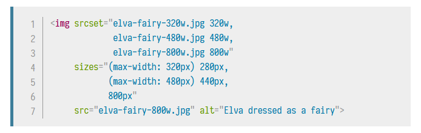

        3.  srcset：定义了允许浏览器选择的图像集，以及每个图像的大小。在每个逗号之前：

            1.  一个文件名

            2.  一个空格

            3.  图像的固有宽度

        <!-- -->

        1.  sizes：定义了一组媒体条件，并且制定当某些媒体条件为真的时候，什么样的图片尺寸是最佳选择：

            1.  一个媒体条件

            2.  一个空格

            3.  当媒体条件为真时，图像将填充的槽的宽度

        <!-- -->

        1.  查询算法：

            1.  查看设备宽度

            2.  检查 sizes 列表中哪个媒体条件是第一个为真

            3.  查看给予该媒体查询的槽的大小

            4.  加载 srcset 列表中引用的最接近所选的槽大小的图像

    <!-- -->

    1.  美术设计：

        1.  &lt;picture&gt; 元素允许我们类似 &lt;video&gt; &lt;audio&gt; ,允许包含一些 &lt;source&gt; 元素：

            1.  

            2.  特性：

                1.  &lt;source&gt; 元素包含一个 media 属性，包含一个媒体条件，能够决定哪张图片会被显示 —— 第一个条件返回真，则会显示

                2.  srcset 属性包含要显示图片的路径，也可以使用 sizes 属性

                3.  在任何情况下都应该使用一个 img 和它的 src 以及 alt 属性，来作为回退

        <!-- -->

        1.  为什么不应使用 CSS 或者 Javascript

            1.  当开始加载一个界面的时候，主解析器会在加载和解析页面的 CSS 和 Javascript 之前预加载任意的图片。而避免加载完毕后执行

            2.  大胆的使用现代图像格式，picture 让我们在能满足老旧浏览器需要的同时，实践新的技术

            3.  

        <!-- -->

        1.  注意：

            1.  在不使用美术设计的情况下不要使用 media 属性

            2.  在 source 元素中，只能在引用 type 中声明文件类型

            3.  像之前一样，如果必要，你可以在srcset和sizes中使用逗号分割的列表

<!-- -->

1.  HTML 表格

    1.  HTML 表格基础

        1.  不使用 HTML 表格的场合：表格布局

            1.  表格布局减少了视觉受损用户的可访问性

            2.  表格会产生许多标签，导致复杂和性能损失

            3.  表格不能自动响应

        <!-- -->

        1.  基本标签：

            1.  table 表格

            2.  td ，table data 单元格

            3.  tr， 单元行

            4.  th，标题（包括行标题和列标题）

        <!-- -->

        1.  实践经验：

            1.  添加标题：

                1.  标题明显突出的时候，可以更加简单地找到想要的数据，设计上也会看起来更好

                2.  表格会有一些默认样式

                3.  表格标题有额外的好处，随着 scope 属性，允许使得表格变得更加无障碍

            <!-- -->

            1.  跨越多行和列

                1.  使用 colspan 和 rowspan 占据多个单元格

            <!-- -->

            1.  为表格中的列提供共同的样式

                1.  使用 &lt;col&gt; &lt;colgroup&gt; 可以定义整列数据，避免为每个&lt;td&gt;上样式或者使用 nth-child

                2.  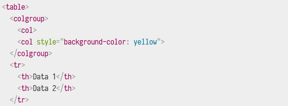

                3.  跨列的列可以使用 span="number" 来定义

    <!-- -->

    1.  HTML 表格高级特性和可访问性

        1.  使用 caption 为你的表格增加一个标题：&lt;caption&gt; 标签放在 &lt;table&gt; 下面，包含对于表格内容的描述

        2.  thead、tfoot、tbody

            1.  添加 thead、tfoot、tbody 的结构，thread 嵌套在 table 结构中，放在头部的位置，代表第一行；除非使用 col/colgroup 结构，那么 thead 结构放在下面

            2.  tfoot 嵌套在 table 中，放在底部最后一行，代表对所有行的总结

            3.  tbody 放在 thead 和 tfoot 之间

        <!-- -->

        1.  能够嵌套表格

        2.  对于视力受损用户的表格

            1.  使用列和行的标题：屏幕阅读设备会识别所有的标题，然后在它们和它们的所关联的单元格之间产生编程关联

            2.  scope 属性：可以添加在 th 元素中，帮助屏幕阅读设备更好地了解那些标题单元格，说明是列标题和行标题: 例如 &lt;th scope="col"&gt;，可选项还有 col、row、colgroup、rowgroup

            3.  id 和标题属性：

                1.  可以使用 id 和 headers 属性来创造标题与单元格之间的联系。使用方法如下：

                    1.  为每个 th 元素添加一个唯一的 id

                    2.  为每个 td 元素添加一个 headers 属性，每个单元格的 headers 属性需要包含它从属于的所有标题的 id，之间用空格分开

<!-- -->

1.  HTML 表单

    1.  基本介绍

        1.  简介：

            1.  用处：HTML 表单是用户和 WEB 站点及应用程序之间交互的主要内容之一。允许用户将数据发送到 WEB 站点，页面可以自己拦截数据并使用它。

            2.  组成：一个或者多个小部件组成。这些小部件可以是文本字段、选择框、按钮、复选框、单选按钮。大多数情况下，小部件与描述其目的的标签配对 —— 正确实现的标签能够清楚地指示视力正常的用户和盲人用户输入表单所需的内容。

        <!-- -->

        1.  设计原则：保持简单、保持专注 —— 只要求必要的数据。表单越大，失去用户的风险越大。

        2.  基本元素：

            1.  form：把所有内容都放在里面，许多辅助技术或浏览器插件可以发现 form 元素并实现特殊的钩子

                1.  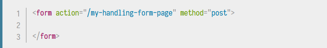

                2.  属性：

                    1.  action 属性定义了在提交表单时，应该把所收集的数据传送给哪个 URL 处理

                    2.  method 属性定义了发送数据的 HTTP 方法（可以是 get 或者 post）

                <!-- -->

                1.  注意：严禁在一个表单内嵌套另一个表单，会使得表单的行为不可预知，这取决于正在使用的浏览器

            <!-- -->

            1.  label：使用 for 和 表单项的 id 之间建立关联。标签内内容为显示内容

                1.  &lt;label for="target-id"&gt;

                2.  它是将标签链接到表单小部件的一种正规方式，这个属性应用对应的小部件的 id

                3.  点击标签：正确设置标签的另一个好处是可以在所有浏览器中单击标签来激活相应的小部件。这对于像文本输入这样的例子很有用，这样你可以通过点击标签，和点击输入区效果一样，来聚焦于它

                4.  多个标签：

                    1.  可以在一个小标签中放置多个标签，但是一些辅助结束可能难以除以它们。在多个标签情况下，应该将小部件和它的标签嵌套在一个 label 当中

                    2.  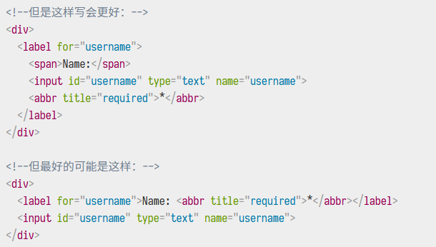

            <!-- -->

            1.  input

                1.  

                2.  属性：

                    1.  type 属性定义了 input 属性的行为方式

                    2.  value 属性定义了初始值

            <!-- -->

            1.  textarea

                1.  

                2.  属性：

                    1.  默认值：相反，如果您想定义&lt;textarea&gt;的默认值，您只需在&lt;textarea&gt;元素的开始和结束标记之间放置默认值，就像这样

            <!-- -->

            1.  button

                1.  type 属性定义为 submit/reset/button 之一的值

                    1.  submit 会发送表单数据到 form 元素的 action 属性所定义的网页

                    2.  reset 会将 form 中所有小部件重新设置为它们的初始值

                    3.  button 值的按钮不会发生任何事情

                <!-- -->

                1.  还可以用相应类型的 input 元素来生成一个按钮，如 input type=submit 但是只能容纳文本类型的值

            <!-- -->

            1.  fieldset 和 legend

                1.  简介：是一种方便的用于创建具有相同目的小元素组的方式，可以在开口标签内加一个 legend 元素给 fieldset 标上标签

                2.  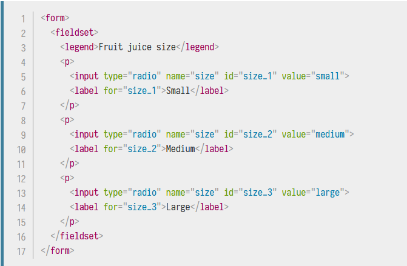

    <!-- -->

    1.  原生表单部件：

        1.  通用属性：

            1.  

<table><thead><tr class="header"><th>属性名称</th><th>默认值</th><th>描述</th></tr></thead><tbody><tr class="odd"><td>autofocus</td><td>false</td><td>该布尔属性允许指定页面加载时元素应该自动具有输入焦点，除非用户覆盖它。文档中只能够有一个文档相关的属性能够指定该属性</td></tr><tr class="even"><td>disabled</td><td>false</td><td>该布尔属性指明用户不能和元素交互，可以继承（例如 fieldset）</td></tr><tr class="odd"><td>form</td><td> </td><td>小部件与之关联的表单元素。必须是同文档中某表单的 id</td></tr><tr class="even"><td>name</td><td> </td><td>元素的名称，和表单一起提交</td></tr><tr class="odd"><td>value</td><td> </td><td>元素的初始值</td></tr></tbody></table>

1.  文本输入框：

    1.  通用规范：

        1.  可以被标记为 readonly （用户不能修改输入值）、disabled（输入值不会和表单一起发送）

        2.  可以由 placeholder，是表单中默认出现的文本，用来简略的描述输入框的目的

        3.  可以被限制在 size（框的物理尺寸） 和长度（最大输入的字符数）

        4.  如果浏览器支持，可以拼写检查

    <!-- -->

    1.  单行文本框：type='text' 则为单行文本框，或者作为不识别/不支持type的回退显示选项

    2.  email 地址框：type=email，用户需要输入有效的电子邮件地址，任何其他内容都会导致浏览器在提交表单时显示错误。

        1.  包括 multiple 属性，可以让输入多个逗号分隔的电子邮件

    <!-- -->

    1.  密码框：type=password，不会为输入的文本添加任何特殊的约束，但是会模糊输入到字段中的值

    2.  搜索框：type=search，取决于浏览器特性：搜索框可能圆角、可能包含一个 x 来清除输入的值，可能被自动保存来在一个站点的多个页面上自动补全

    3.  电话号码框：type=tel 在语义上区分该栏为电话号码

    4.  URL 栏：type=url 在语义和格式上区分该栏为 URL

    5.  多行文本框：使用 &lt;textarea&gt; 元素，它允许用户包含硬换行（回车）的文本

        1.  属性：

            1.  cols 默认值 20，文本控件的可见宽度，平均字符宽度

            2.  rows 控制的可见文本行数

            3.  wrap 控件是如何包装文本的，可能值 hard、soft

        <!-- -->

        1.  其默认值在标签内容中

        2.  其只接受纯文本内容

<!-- -->

1.  下拉内容

    1.  选择框：

        1.  

        2.  组成：一个 select 元素创建，其中有一个或者多个 option 元素作为子元素，每个元素都指定其中一个可能的值，可以包含选项组：

            1.  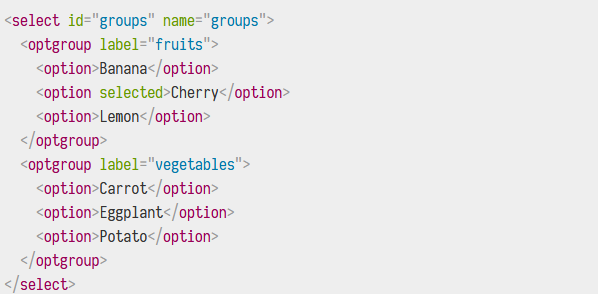

        <!-- -->

        1.  属性：

            1.  selected 选择框的默认值

            2.  value 选择该选项时设定的值，不设置则选择 option 元素的内容

            3.  optgroup 元素中，lable 显示在值之前，不是可选的

            4.  在 select 上设置 multiple 属性，则可以允许用户通过操作系统提供的默认机制来选择几个值，此时选择框不再显示为下拉内容，而显示在一个列表中

    <!-- -->

    1.  自动输入补全：可以使用 datalist 元素来为表单小部件提供建议的、自动完成的值，并使用一些 option 子元素来指定要显示的值

        1.  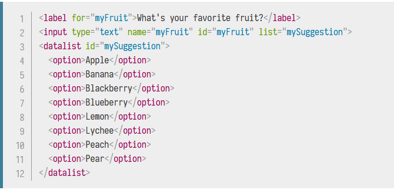

        2.  属性：list 属性可以将数据列表绑定到一个文本框

        3.  注意：一旦数据列表与表单小部件相关联，它的选项用于自动完成用户输入的文本;通常，这是作为一个下拉框提供给用户的，匹配在输入框中输入了的内容。

<!-- -->

1.  可选中项：

    1.  通用说明：

        1.  可选中项是可以通过单击它们来更改状态的小部件。都使用 checked 属性，以指示该部件的默认状态：选中或者未选中

        2.  对于大多数组件，若表单提交，则具有name属性的小部件也将被提交；对于可选中项，只有选中才会发送值，否则连 name 也不会发送

        3.  为了最大可用性和可访问性建议使用 fieldset 包围每个相关项目的列表，并使用 legend 提供对列表的全面描述。

    <!-- -->

    1.  复选框：type=checkbox

        1.  

    <!-- -->

    1.  单选按钮：type=radio

        1.  

        2.  几个单选按钮可以连接在一起，如果他们的 name 属性共享相同的值，name 将被认为属于同一组按钮，同一组只能选择一个

        3.  如果一个都没选中，则不以表单形式发送任何

<!-- -->

1.  按钮

    1.  submit：将表单数据发送到服务器，不设置 type 则 button 默认为 submit

    2.  reset：将所有表单小部件重新设为默认值

    3.  anonymous：没有自动生效的按钮，但是可以在 JS 代码中进行定制

<!-- -->

1.  数字：input type = number，看起来像文本框，但是只允许浮点数，并且提供一些按钮来增加或者减少小部件

    1.  min 和 max 来约束该值

    2.  step 属性来指定增加或者减少按钮更改小部件的步进值大小

<!-- -->

1.  滑块：input type=range

    1.  min max

    2.  step

    3.  一般不显示数值，需要通过 JavaScript 的方式交互

<!-- -->

1.  日期时间选择器

    1.  种类：

        1.  本地时间：input type=datetime-local

        2.  月：input type=month

        3.  时间：input type=time

        4.  星期：input type=week

    <!-- -->

    1.  通用说明：

        1.  所有日期和时间控制都能够使用 min 和 max 属性来约束

<!-- -->

1.  拾色器：

    1.  input type=color，safari 不支持

    2.  可以使用 canvas + JS 实现

<!-- -->

1.  文件选择器：input type=file

    1.  用途：将文件发送到服务器

    2.  属性：

        1.  accept 被接受的文件类型可以使用 accept 属性来约束

        2.  multiple 如果想让用户选择多个文件，可以通过添加 multiple 属性来实现

<!-- -->

1.  隐藏内容：input type=hidden

    1.  有些值通过表单发送，但不显示给用户

    2.  设置它的 name 和 value 属性

<!-- -->

1.  图像按钮：input type=image 是一个与 img 元素完全相同的元素，当用户点击它时，它的行为就像一个提交按钮

    1.  如果使用图像按钮来提交表单，这个部件不会提交它的值，而是提交在图像上单击处相对于图像原点的坐标，作为键值对提交

<!-- -->

1.  进度条：progress 元素，它会随着时间的变化而变化到最大的值，该值有 max 属性指定。

    1.  属性：max 最大值

    2.  回退：标签内容

<!-- -->

1.  仪表：meter 元素，表示一个由 min 和 max 值界定的固定值，作为一个条形显示

    1.  low 和 high 值范围划分为三个部分

        1.  该范围中较低的部分是 min 和 low 之间的值

        2.  中间部分是 low 和 high 之间的值

        3.  较高部分是 high 和 max 值

    <!-- -->

    1.  optimum 值定义了最优值，在 low、meter 和 high 值的联合中，它定义了该范围哪个部分最优先

        1.  如果 optimum 在较低范围内，则较低范围被认为首选项，中等一般，高最坏

        2.  如果中等，较低和较高都被认为一般，中等较优

        3.  如果较高，较低最坏，中等一般，较高较优

    <!-- -->

    1.  所有实现 meter 元素的浏览器都使用这些值来改变米尺的颜色

        1.  如果当前值位于该范围的优先部分，则该条是绿色的

        2.  位于一般部分，则黄色

        3.  位于糟糕部分，则绿色

    <!-- -->

    1.  回退：元素内容

<!-- -->

1.  发送表单数据

    1.  客户端定义发送数据：

        1.  action 属性：

            1.  表单的 action 使用绝对 URL 或者相对 URL

            2.  action 不设置或设置为本页 id 钩子的时候，会发送到相同页面

        <!-- -->

        1.  method 属性

            1.  GET 方法:

                1.  格式 URL?param1=value1&param2=value2…

            <!-- -->

            1.  POST 方法：

                1.  格式：

                    1.  

    <!-- -->

    1.  发送文件：

        1.  说明：文件是二进制数据，HTTP 是一种文本协议，处理二进制数据有特殊要求

        2.  enctype 属性

            1.  该属性指定提交表单时所生成请求中的 Content-Type 的 HTTP 数据头的值

            2.  默认情况其值为 application/x-www-form-urlencoded（已编码为 URL 参数的表单数据）

        <!-- -->

        1.  经验说明：

            1.  将 method 设置为 POST，URL 不能包含 二进制数据

            2.  将 enctype 设置为 multipart/form-data，因为数据被封为多个部分，每个文件单独占用一个部分，正文表单中包含的文本数据占用一个部分

            3.  包含一个或者多个 File picker 小部件，允许用户选择将要上传的文件

        <!-- -->

        1.  常见的安全问题：

            1.  XSS 和 CSRF

                1.  XSS 跨站脚本，允许攻击者将客户端脚本注入到其它用户查看的 Web 页面中，攻击者可以使用跨站脚本攻击的漏洞来绕过同源策略在内的访问控制。它利用用户对 WEB 站点的信任

                2.  CSRF 跨站请求伪造，向 Web 页面中注入客户端脚本，试图将权限提升到特权用户，执行它们不该执行的操作。它利用网站对其用户的信任

                3.  为了防止这些攻击，应该始终检查需要显示的用户发送给服务器的数据，尽量不使用用户提供的 HTML 内容，如果必要，使用过滤去消除用户脚本

            <!-- -->

            1.  SQL 注入

                1.  试图向用户发送 SQL 请求，希望服务器能够执行它

            <!-- -->

            1.  HTTP 数据头注入和电子邮件注入

                1.  出现在当应用程序基于表单上的用户的数据输入构建的 HTTP 头部或者电子邮件。可能劫持或者网络钓鱼攻击

            <!-- -->

            1.  单向劫持（Clickjacking）: iframe 中嵌入恶意内容

                1.  https

                2.  sandbox iframe

                3.  尽量少地使用嵌入内容

                4.  CSP 头

            <!-- -->

            1.  偏执：永远不要相信用户

                1.  所有到达服务器的数据必须经过检查和消毒

                    1.  远离有潜在危险的字符转义。应该谨慎使用特点字符决定于所使用的数据的上下文和所使用的服务器平台

                    2.  限制输入的数据量，只允许有必要的数据

                    3.  沙箱上传文件

                <!-- -->

                1.  即使是一个值得信赖的用户也可能会被劫持

    <!-- -->

    1.  表单数据校验

        1.  坚持表单数据校验的原因：

            1.  我们希望以正确格式获取正确的数据 —— 保持程序正常运行

            2.  我们希望保护用户 —— 强制用户输入安全的密码，有利于保护它们的账户信息

            3.  希望保护自己 —— 恶意用户通过滥用应用汇总缺乏保护的表单破坏应用的方法

        <!-- -->

        1.  不同类型的表单数据校验：

            1.  客户端校验 —— 用户体验较好

                1.  Javascript 校验，用户自定义的实现

                2.  HTML5 内置校验，不需要 JavaScript，性能好，但缺乏自定义性

            <!-- -->

            1.  服务端校验

                1.  发生在提交数据并被服务器程序接收之后，如果数据未通过校验，则会直接从服务器端返回错误消息，并且告诉浏览器端发生错误的具体位置和原因

                2.  服务器端校验不像客户端校验那样有好的用户体验

        <!-- -->

        1.  使用内置的表单数据校验：

            1.  状态和影响：

                1.  当一个元素通过校验时

                    1.  该元素可以通过 CSS 伪类 :valid 进行特殊的样式化

                    2.  如果用户提交表单，如果没有其他控制来阻止提交该操作，则表单数据会被通过

                <!-- -->

                1.  当一个元素未校验通过

                    1.  该元素将可以通过 CSS 伪类 :invalid 进行特殊的样式化

                    2.  如果用户尝试提交表单，浏览器会展示出错误消息，并停止表单的提交

            <!-- -->

            1.  required 属性：当设置此属性时，如果输入为空，则表单不会提交，输入被视为无效

            2.  正则表达式校验：pattern 属性，将正则表达式作为 value 值

            3.  限制输入的长度：

                1.  所有文本框都可以使用 minlength 和 maxlength 属性来限制长度

                2.  数字条目可以使用 min 和 max 属性提供同样的校验约束

        <!-- -->

        1.  自定义错误信息：

            1.  自动生成的错误信息取决于浏览器

                1.  没有标准可以让 CSS 来改变它们的外观

                2.  依赖于它们使用的浏览器环境，意味着可能在该语言的网页中得到另一种语言的错误提示

            <!-- -->

            1.  自定义消息的文本和外观：必须使用 JS

                1.  

        <!-- -->

        1.  使用 JavaScript 校验表单

            1.  约束的校验 API

                1.  HTMLButtonElement

                2.  HTMLFieldSetElement

                3.  HTMLInputElement

                4.  HTMLOutputElement

                5.  HTMLSelectElement

                6.  HTMLTextAreaElement

            <!-- -->

            1.  约束校验的 API 以及属性

                1.  

<table><thead><tr class="header"><th><strong>属性</strong></th><th><strong>描述</strong></th></tr></thead><tbody><tr class="odd"><td>validationMessage</td><td>一个本地化消息，描述元素不满足校验条件时（如果有的话）的文本信息。如果元素无需校验（willValidate 为 false），或元素的值满足校验条件时，为空字符串。</td></tr><tr class="even"><td>validity</td><td>一个 <a href="https://developer.mozilla.org/zh-CN/docs/Web/API/ValidityState">ValidityState</a> 对象，描述元素的验证状态。详见有关可能的验证状态的文章。</td></tr><tr class="odd"><td>validity.customError</td><td>如果元素设置了自定义错误，返回 true ；否则返回false。</td></tr><tr class="even"><td>validity.patternMismatch</td><td>
如果元素的值不匹配所设置的正则表达式，返回 true，否则返回 false。

 

当此属性为 true 时，元素将命中  <a href="https://developer.mozilla.org/zh-CN/docs/Web/CSS/:invalid">:invalid</a> CSS 伪类。
</td></tr><tr class="odd"><td>validity.rangeOverflow</td><td>
如果元素的值高于所设置的最大值，返回 true，否则返回 false。

 

当此属性为 true 时，元素将命中  <a href="https://developer.mozilla.org/zh-CN/docs/Web/CSS/:invalid">:invalid</a> CSS 伪类。
</td></tr><tr class="even"><td>validity.rangeUnderflow</td><td>
如果元素的值低于所设置的最小值，返回 true，否则返回 false。

 

当此属性为 true 时，元素将命中  <a href="https://developer.mozilla.org/zh-CN/docs/Web/CSS/:invalid">:invalid</a> CSS 伪类。
</td></tr><tr class="odd"><td>validity.stepMismatch</td><td>
如果元素的值不符合 step 属性的规则，返回 true，否则返回 false。

 

当此属性为 true 时，元素将命中  <a href="https://developer.mozilla.org/zh-CN/docs/Web/CSS/:invalid">:invalid</a> CSS 伪类。
</td></tr><tr class="even"><td>validity.tooLong</td><td>
如果元素的值超过所设置的最大长度，返回 true，否则返回 false。

 

当此属性为 true 时，元素将命中  <a href="https://developer.mozilla.org/zh-CN/docs/Web/CSS/:invalid">:invalid</a> CSS 伪类。
</td></tr><tr class="odd"><td>validity.typeMismatch</td><td>
如果元素的值出现语法错误，返回 true，否则返回 false。

 

当此属性为 true 时，元素将命中  <a href="https://developer.mozilla.org/zh-CN/docs/Web/CSS/:invalid">:invalid</a> CSS 伪类。
</td></tr><tr class="even"><td>validity.valid</td><td>
如果元素的值不存在校验问题，返回 true，否则返回 false。

 

当此属性为 true 时，元素将命中  <a href="https://developer.mozilla.org/zh-CN/docs/Web/CSS/:valid">:valid</a> CSS 伪类，否则命中 <a href="https://developer.mozilla.org/zh-CN/docs/Web/CSS/:invalid">:invalid</a> CSS 伪类。
</td></tr><tr class="odd"><td>validity.valueMissing</td><td>
如果元素设置了 required 属性且值为空，返回 true，否则返回 false。

 

当此属性为 true 时，元素将命中  <a href="https://developer.mozilla.org/zh-CN/docs/Web/CSS/:invalid">:invalid</a> CSS 伪类。
</td></tr><tr class="even"><td>willValidate</td><td>如果元素在表单提交时将被校验，返回 true，否则返回 false</td></tr></tbody></table>

1.  校验校验 API 的方法：

    1.  

<table><thead><tr class="header"><th>checkValidity()</th><th>如果元素的值不存在校验问题，返回 true。如果文件校验失败，此方法会触发 invalid 事件</th></tr></thead><tbody><tr class="odd"><td>HTMLFormElement.reportValidity()</td><td>如果元素或者它的子元素空间符合校验的限制，返回 true，当返回 false 时，对每个无效元素可撤销 invalid 事件会被唤起并且校验错误会被报告给用户</td></tr><tr class="even"><td>SetCustomValidity(message)</td><td>
为元素添加一个自定义的错误消息；如果设置了自定义错误消息，该元素被认为是无效的，则显示指定的错误。这允许你使用 JavaScript 代码来建立校验失败，而不是用标准约束校验 API 所提供的。这些自定义信息将在向用户报告错误时显示。

 

如果参数为空，则清空自定义错误。
</td></tr></tbody></table>

1.  JS 校验实战

    1.  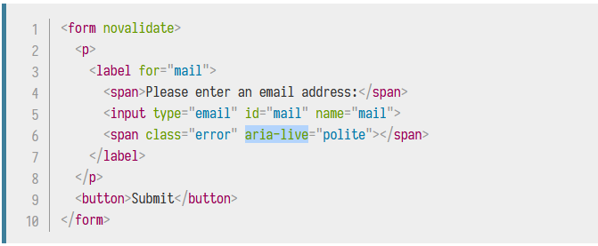

    2.  说明：

        1.  form 的 novalidate 属性关闭浏览器的自动校验，允许使用脚本控制表单校验

        2.  aria-live 属性确保我们自定义的错误信息将呈现给所有人，包括使用屏幕阅读器等辅助技术

<!-- -->

1.  不使用内建 API 时的表单校验

    1.  应该进行怎样的校验：字符串操作、类型转换、正则表达式等

    2.  如果表单校验失败的做法：您必须决定表单的行为方式：表单是否发送数据？ 是否突出显示错误的字段？是否显示错误消息？

    3.  如何帮助用户纠正无效数据：为了减少用户的挫折感，提供尽可能多的有用的信息是非常重要的，以便引导他们纠正他们的输入。 您应该提供前期建议，以便他们知道预期的输入是什么以及明确的错误消息。

<!-- -->

1.  如何构建表单小工具：设计、结构和语义

    1.  定义控件如何到达每个状态开始：

        1.  以下状态控件处于正常状态

            1.  页面加载

            2.  控件处于活动状态、但焦点在控件以外位置

            3.  空间活动且聚焦

        <!-- -->

        1.  以下状态处于活动状态：

            1.  用户点击

            2.  用户按下 tab 让控件获得了焦点

            3.  控件呈现打开状态然后用户点击控件

        <!-- -->

        1.  以下状态控件处于打开状态：

            1.  控件在非打开状态被用户点击

    <!-- -->

    1.  定义以下状态控件的值将会被改变

        1.  控件在被打开状态下用户点击一个选项

        2.  控件在活动状态下用户按下键盘上方向键或者下方向键

    <!-- -->

    1.  定义控件的选项将如何表现：

        1.  当控件在打开状态下，被选中的选项将被突出显示

        2.  当鼠标悬停在某个选项时，该选项被突出显示，并且之前突出显示的选项将返回正常的状态

    <!-- -->

    1.  定义标准和规范未定义行为：如果你定义的行为不够好，或者忘记定义了一个行为，那么在用户开始实际使用时，将会很难去重新定义它们。如果你在定义时有疑问，请征询他人的意见，如果你有预算，进行用户可行性测试，这个过程被称为UX design

<!-- -->

1.  使用 JS 发送表单

    1.  获得整体界面的控制：

        1.  标准的 HTML 表单提交会加载数据到要发送到的 URL，意味着浏览器窗口以整页加载进行导航

        2.  可以通过隐藏闪烁、网络滞后来避免整页加载以提供更平滑的体验

    <!-- -->

    1.  发送表单数据

        1.  XMLHttpRequest

            1.  是进行 HTTP 请求最安全和可靠的方式

            2.  

        <!-- -->

        1.  使用 XMLHttpRequest 和 the FormData object 表单数据对象

            1.  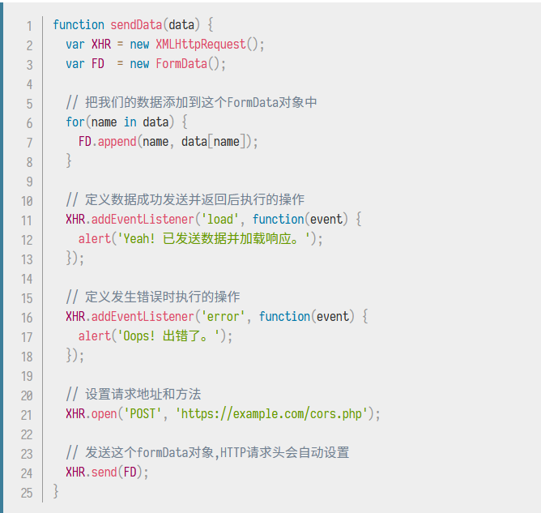

        <!-- -->

        1.  使用绑定到表单元素上的 FormData

            1.  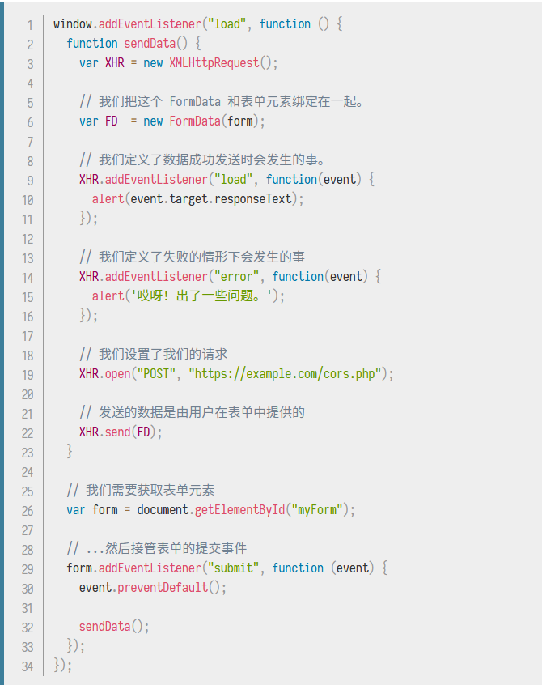

<!-- -->

1.  启用 CORS 的图片以及 CORS 设定

    1.  安全性和“被污染”的 canvas

        1.  不通过 CORS 可以在 canvas 中使用其它来源的图片，但是会污染画布，并且不再被认为是安全的画布

        2.  被污染的画布中调用以下方法会抛出安全错误：

            1.  在 canvas 的上下文上调用 getImageData()

            2.  在 canvas 上调用 toBlob()

            3.  在 canvas 上调用 toDataURL()

    <!-- -->

    1.  基本配置

        1.  网站服务器配置：首先必须有一个可以对图片响应正确 Access-Control-Allow-Origin 响应头的服务器

            1.  "Access-Control-Allow-Origin":"\*"

        <!-- -->

        1.  在 HTMLImageElement 上设置 crossOrigin 的 crossorigin 属性，这将允许浏览器在下载图像数据允许跨访问请求

            1.  img.crossOrigin = "Anonymous"

    <!-- -->

    1.  CORS 设置属性

        1.  例如 audio、img、link、script、video 均有一个跨域属性 crossOrigin，它允许配置元素获取数据的 CORS 属性

            1.  

<table><thead><tr class="header"><th>关键字</th><th>描述</th></tr></thead><tbody><tr class="odd"><td>anonymous</td><td>对此元素的 CORS 请求将不设置凭据标志</td></tr><tr class="even"><td>use-credentials</td><td>对此元素的 CORS 请求将设置凭证标志，意味着请求将提供凭据</td></tr><tr class="odd"><td>""</td><td>设置一个空值，如 crossorigin 或者 crossorigin=""，和设置 anonymous 的效果一样</td></tr></tbody></table>

1.  SEO

    1.  搜索引擎优化是一种让网站在搜索引擎中更加清晰、且搜索结果更靠前的方法

    2.  技术：使用语义标记内容 HTML，抓取工具应该只找到要编入索引的内容

    3.  撰稿：使用访问者的词汇编写内容。使用文本和图像，以便于抓取工具可以理解主题

    4.  声望：当其他已建立的站点链接到试图 SEO 的站点的时候，将获得最多的流量

<!-- -->

1.  使用 rel=preload 进行内容预加载

    1.  简要：link 元素的 rel 属性的属性值 preload 能够让在 HTML 元素内部书写一些声明式的资源获取请求，可以指明哪些是加载完成后立即需要的

    2.  案例：

        1.  

        2.  原理解释：预加载 CSS 和 JavaScript 文件，所以在随后的页面渲染当中，一旦需要使用他们，则立即可用

    <!-- -->

    1.  优势：

        1.  更精确地优化资源加载优先级

        2.  匹配未来的加载需求，在适当的情况下，重复利用同一资源

        3.  为资源应用正确的内容安全策略

        4.  为资源设置正确的 Accept 请求头

    <!-- -->

    1.  类型：

        1.  audio

        2.  document 将要嵌入到 frame 或 iframe 内部的 HTML 文档

        3.  embed 将要被嵌入到 embed 元素内部的资源

        4.  fetch 将要通过 fetch 和 XHR 请求来获取的资源

        5.  font 字体文件

        6.  image

        7.  object 将会被嵌入 embed 内部的文件

        8.  script

        9.  style 样式表

        10. track WebVTT 文件

        11. worker 一个 JavaScript 的 web worker

        12. video

    <!-- -->

    1.  type：link 元素可以包含一个 type 属性，在进行预加载的时候

        1.  这个属性将非常有效 —— 将判断它是否支持这一资源，否则将忽略

        2.  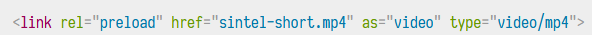

    <!-- -->

    1.  跨域获取：需要跨域，在 link 中设置 crossorigin="anonymous" 属性即可

    2.  包含媒体：在 link 中设置 media = "()" 即可

    3.  脚本化与预加载：

        1.  

>  

1.  

<!-- -->

1.  其它资源预加载机制：rel=prefetch 被浏览器支持了相当长的时间，prefetch 意图预获取之后其它页面使用的其它资源
