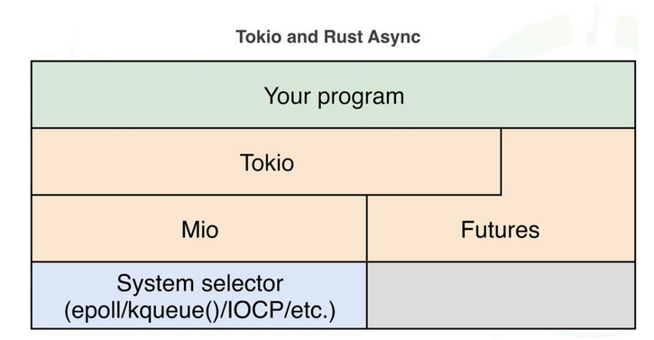

# 深入浅出 Rust 异步编程之 Tokio

## Rust 用户态线程

- 基于 Future
- 零成本抽象
- 无内存时内存大量内存分配，无 GC 开销



## Futures

Rust 的 Futures 采用拉模式来实现：

```rust
pub trait Future {
    type Item;
    type Error;
    fn poll(&mut self) -> Poll<Self::Item, Self::Error>;
}
```

从 TCP 数据流读取了多少个字节并进行回调：

```rust
struct MyTcpStream {
    socket: TcpStream,
    nread: u64
}

impl Future for MyTcpStream {
    type Item = u64;
    type Error = io::Error;

    fn poll(&mut self) -> Poll<Item, Error> {
        let mut buf = [0;10];
        loop {
            match self.socket.read(&mut buf) {
                Async::Ready(0) => return Async::Ready(self.nread),
                Async::Ready(n) => self.nread += n,
                Async::NotReady => return Async::NotReady,
            }
        }
    }
}
```

## Tokio

Scheduler 负责对 task 进行调度，reactor 部分负责事件触发；每当事件触发的时候，reactor 会通过 task 的 api 进行 scheduler 运行该任务。

## Async/await

示例代码：

```rust
#[tokio::main]
pub async fn main() -> Result<(), Box<dyn Error>> {
    let mut stream = TcpStream::connect("127.0.0.1:6142").await?;
    println!("created stream");
    let result = stream.write(b"hello world\n").await;
    println!("wrote to stream; success={:?}", result.is_ok());
    Ok(())
}
```